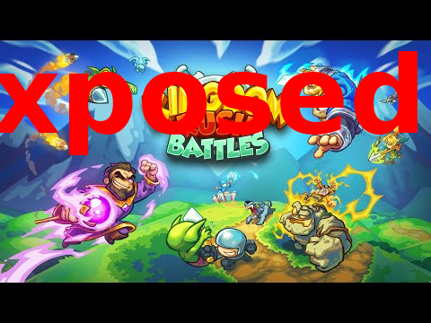

# Kingdom Rush Battles - Full Security & Reverse Engineering Report
<p align="center">
  
</p>

**Author:** LogicBr3ak3r
**Contact:** Telegram - [@LogicBr3ak3r](https://t.me/LogicBr3ak3r)

> **Note on Tools & Scripts:** All scripts and automation tools developed during this research - including `auto_farm.py` (the full economy farming bot), the PvP headless client, the savegame editor, and supporting utilities - will be released publicly once these reports gain sufficient attention. Follow the Telegram contact above to stay notified.

---

## Foreword

The moment that broke me wasn't losing. I can lose. The moment was realizing the match was over before it started - not because my opponent was better, but because their card collection was three gem packs deeper than mine. Pay-to-win isn't a game design choice, it's a business model disguised as one. And Kingdom Rush Battles wears it openly.

So I did what any reasonable person does when a system takes their money and calls it a game: I tore it apart at the binary level.

What I found is that while the developers were busy designing fourteen different ways to separate players from their wallets, they left the back door wide open. The server trusts the client to report its own match results. The encryption on the save file uses a hardcoded key that never changes. And the Quantum anti-cheat system - the one that was supposed to guarantee fair play - is explicitly, deliberately disabled in the production build. Not broken. Turned off.

Every gem you spent was funding a system held together with tape.

> If you've been through the same, or you want to talk about what's in here - you know where to find me.
> **Telegram: [@LogicBr3ak3r](https://t.me/LogicBr3ak3r)**

---

## Companion Reports

This is the main report. The following documents were written alongside it and cover specific areas in deeper technical detail:

| Report | Description |
| ------ | ----------- |
| [krb-pvp-protocol](https://github.com/LogicBr3ak3r/krb-pvp-protocol) | Full reverse engineering of the Photon Quantum real-time PvP protocol - connection, matchmaking, command serialization, and the 24-step match handshake |
| [krb-ai-engine](https://github.com/LogicBr3ak3r/krb-ai-engine) | Complete analysis of the re-implemented AI decision engine - utility scoring, threat calculation, hero/spell/modifier AI, and the full C# simulation architecture |
| [krb-api-analysis](https://github.com/LogicBr3ak3r/krb-api-analysis) | Catalog of every exploitable API endpoint with request/response examples and attack chains |
| [krb-damage-research](https://github.com/LogicBr3ak3r/krb-damage-research) | Binary-level analysis of the damage pipeline, fixed-point arithmetic, ECS component layout, and card level scaling |
| [krb-stat-tables](https://github.com/LogicBr3ak3r/krb-stat-tables) | Deck-aware damage simulation model with complete hero, spell, and tower stat tables extracted from CDN asset bundles |

---

## Game Info


| Field              | Value                                                              |
| ------------------ | ------------------------------------------------------------------ |
| **Game**           | Kingdom Rush Battles (Multiplayer / Battles)                      |
| **Package**        | `com.ironhidegames.kingdomrush.mp`                                 |
| **Version**        | `1.7.0` (versionCode: 102)                                         |
| **Developer**      | Ironhide Games (published by Miniclip)                             |
| **Engine**         | Unity (IL2CPP, armeabi-v7a)                                        |
| **Multiplayer**    | Photon Quantum (deterministic simulation)                          |
| **Min SDK**        | 24 (Android 7.0)                                                   |
| **Target SDK**     | 35 (Android 15)                                                    |
| **IL2CPP Version** | 31                                                                 |
| **Protection**     | Possible binary protection detected ("This file may be protected") |


---

## Architecture Overview

```
                        ┌─────────────────────────────┐
                        │   Backend API (AWS)          │
                        │   api.mp-ironhidegames.com   │
                        └──────────┬──────────────────┘
                                   │ HTTPS REST
        ┌──────────────────────────┼──────────────────────────┐
        │                          │                          │
  ┌─────▼─────┐            ┌──────▼──────┐           ┌───────▼──────┐
  │  Photon   │            │  Unity App  │           │  CloudFront  │
  │  Servers  │�-�──────────►│  (IL2CPP)   │──────────►│  CDN (S3)    │
  │  (RT MP)  │  Quantum   │             │  Assets   │              │
  └───────────┘  Protocol  └─────────────┘           └──────────────┘
```

- **Java layer**: Android boilerplate, Firebase, ads SDK, IAP, Google Play Games
- **C# game logic** (IL2CPP): All gameplay, UI, networking, data management
- **Native binary**: `libil2cpp.so` (58.6 MB) + `libunity.so` (15.2 MB)

---

## Servers & Endpoints

### Base URLs


| Name                 | URL                                               | Purpose                |
| -------------------- | ------------------------------------------------- | ---------------------- |
| **Production API**   | `https://api.mp-ironhidegames.com/`               | Main backend           |
| **Dev API**          | `https://api-dev.mp-ironhidegames.link/`          | Development server     |
| **CDN**              | `https://d31ix1hmhuinz8.cloudfront.net`           | Asset bundles, configs |
| **CDN (alt)**        | `https://dnocojpzxs17r.cloudfront.net`            | Secondary CDN          |
| **Health Check**     | `https://d31ix1hmhuinz8.cloudfront.net/healthy`   | CDN health endpoint    |
| **IP Detection**     | `https://api.ipify.org`                           | User IP lookup         |
| **Miniclip Metrics** | `https://cm.sereng.miniclippt.com/client_metrics` | Analytics              |
| **HippoGames OAuth** | `https://hippogames.dev/api/oauth/`               | OAuth provider         |


### API Endpoints (relative to base URL)

#### Chests


| Endpoint                                | Description               |
| --------------------------------------- | ------------------------- |
| `chests/ch/{id}`                        | Get chest by ID           |
| `chests/user/{playerId}`                | Get open chests by player |
| `chests-rewards/chests-reward/{id}`     | Get chest reward by ID    |
| `chests-rewards/chests-reward-by-arena` | Chest rewards for arena   |
| `logic/open-chest`                      | Open a chest              |
| `logic/open-chests`                     | Open multiple chests      |
| `logic/open-chests-stars`               | Open star chests          |
| `logic/open-chests-bravery`             | Open bravery chests       |
| `logic/open-chest-purchase`             | Open purchased chest (IAP, server-validated) |
| `logic/form-chests-to-user`             | Feedback form reward chest (one-time Gold chest, free) |
| `logic/unlock-chests-reward/`           | Chest cycle unlock (bypasses time-lock but charges gems for Silver/Magical) |


#### Trophy & XP Roads


| Endpoint                         | Description            |
| -------------------------------- | ---------------------- |
| `logic/trophy-road-ui`           | Trophy road UI data    |
| `logic/xp-road-ui`               | XP road UI data        |
| `logic/trophies-rewards-claimed` | Claimed trophy rewards |
| `logic/xp-rewards-claimed`       | Claimed XP rewards     |
| `logic/claim-trophy-reward`      | Claim a trophy reward  |
| `logic/claim-xp-reward`          | Claim an XP reward     |


#### Leaderboards


| Endpoint                       | Description                |
| ------------------------------ | -------------------------- |
| `logic/leaderboard-ui/{id}`    | Leaderboard data           |
| `leaderboards-rewards/active/` | Active leaderboard rewards |
| `leaderboards-rewards/claim`   | Claim leaderboard reward   |


#### Daily Missions


| Endpoint                          | Description                    |
| --------------------------------- | ------------------------------ |
| `logic/daily-missions-ui`         | Daily missions data            |
| `logic/claim-mission-token`       | Claim single mission token     |
| `logic/claim-many-mission-token`  | Claim multiple mission tokens  |
| `logic/claim-mission-reward`      | Claim mission road reward      |
| `logic/claim-many-mission-reward` | Claim all mission road rewards |


#### In-App Purchases


| Endpoint                               | Description               |
| -------------------------------------- | ------------------------- |
| `in-app-purchase/filtered-for-user`    | Get IAP offers for user   |
| `in-app-purchase/reload`               | Reload IAP data           |
| `in-app-purchase/product-ids`          | Get product IDs           |
| `in-app-purchase/{id}`                 | Get IAP by ID             |
| `user-purchase/purchase-confirmation`  | Confirm purchase          |
| `user-purchase/purchase-validation`    | Validate purchase receipt |
| `user-purchase/purchase-notify-status` | Notify purchase status    |


#### Events


| Endpoint               | Description                   |
| ---------------------- | ----------------------------- |
| `logic/events-ui/{id}` | Event UI data                 |
| `logic/events/{id}`    | Play summon / claim coin farm |


#### Users & Scouting


| Endpoint                              | Description                                            |
| ------------------------------------- | ------------------------------------------------------ |
| `users/new-user-guest`                | Create new guest account (no device fingerprint needed) |
| `users/user-token`                    | Refresh game JWT via unity-token                       |
| `users/compare-by-playerid`           | Full UserData for 2 players (scouting - see VULN-27)   |


#### Collection & Misc


| Endpoint                        | Description                    |
| ------------------------------- | ------------------------------ |
| `logic/collection-ui`           | Collection UI data             |
| `logic/equip-collection-items`  | Equip collection items         |
| `logic/level-up-card/{id}/`     | Level up a specific card       |
| `logic/disconnect-notify/{id}`  | Notify user disconnect         |
| `logic/rate-us`                 | Rate the game                  |
| `logic/challenge`               | Get integrity challenge        |
| `logic/integrity-check-android` | Android integrity verification |
| `logic/integrity-check-apple`   | Apple integrity verification   |
| `remoteconfig/`                 | Remote configuration           |


#### Privacy


| Endpoint                                        | Description             |
| ----------------------------------------------- | ----------------------- |
| `privacy-framework/coordinated-deletion-system` | Delete all user info    |
| `privacy-framework/user`                        | Get user privacy status |
| `privacy-framework/cancel-deletion`             | Cancel account deletion |


---

## Data Models

### UserData

Core player profile returned by the server:

```
UserData {
    appleId: string          // Apple Sign-In ID
    googleId: string         // Google Play Games ID
    type: string             // Account type
    trophies: int            // Current trophy count
    gold: int                // Soft currency (gold)
    gems: int                // Hard currency (gems)
    winGames: int            // Total wins
    lostGames: int           // Total losses
    currentArenaWins: int    // Wins in current arena
    currentArenaLost: int    // Losses in current arena
    winRate: int             // Win rate percentage
    _id: string              // MongoDB user ID
    createdAt: DateTime
    firstLogin: DateTime
    lastLogin: DateTime
    token: string            // Auth/session token
    currentArena: string     // Current arena ID
    stars: int               // Star count
    nextChestWaiting: DateTime
    braveryOpenTime: DateTime
    matchesToBraveryChest: int
    playerXP: int
    boosterLevel: int
    playerLevel: int
    medals: int
    region: string           // Player region
    dailyTokens: int
    weeklyTokens: int
    summonScrolls: int
    eventTickets: int
    totalChestOpened: int
    totalCreepsKilled: int
    leaderboardRewards: UserLeaderboardRewardsData
}
```

### LoginData

Full response on login:

```
LoginData {
    user: UserData
    userDecks: List<DeckData>
    cards: List<CardData>
    cardRequierement: List<CardRequirementData>
    userChests: List<ChestData>
    settings: UserSettingsData
    lastMatch: MatchData
    trophiesChange: TrophiesChangeData
    medalsChange: TrophiesChangeData
    ip: string               // Player's IP address
}
```

### Currencies


| Currency       | Field           | Type                |
| -------------- | --------------- | ------------------- |
| Gold           | `gold`          | Soft currency       |
| Gems           | `gems`          | Hard currency       |
| Stars          | `stars`         | Progression         |
| Trophies       | `trophies`      | Ranking             |
| Medals         | `medals`        | Ranking (secondary) |
| Daily Tokens   | `dailyTokens`   | Mission currency    |
| Weekly Tokens  | `weeklyTokens`  | Mission currency    |
| Summon Scrolls | `summonScrolls` | Gacha currency      |
| Event Tickets  | `eventTickets`  | Event currency      |


---

## Authentication Flow

1. **Google Auth** (`GoogleAuth`, `GoogleAuthSettings`) or **Apple Auth** (`AppleAuth`)
2. Login sends credentials to backend, receives `LoginData` with `token`
3. Token stored via `DataManager.SetToken()` / cached in `DataCache`
4. All subsequent API calls include the token
5. `RefreshTokenData` class suggests token refresh mechanism
6. `IntegrityValidationData` / `IntegrityChallengeData` for anti-tamper checks
7. `AuthorizationMiddleware` handles request authorization

---

## Key Game Systems (C# Classes)

### Managers (1,311 game classes in Assembly-CSharp)


| Manager               | Purpose                         |
| --------------------- | ------------------------------- |
| `MatchManager`        | Game match lifecycle            |
| `CardManager`         | Card collection & deck building |
| `UICardManager`       | Card UI display                 |
| `UIChestManager`      | Chest opening UI                |
| `UIStarsManager`      | Stars display                   |
| `CollectionsManager`  | Collection items                |
| `EmotesManager`       | In-game emotes                  |
| `IAPManager`          | In-app purchases                |
| `MenuManager`         | Menu navigation                 |
| `SelectionManager`    | Tower/unit selection            |
| `NetworkManager`      | Network connectivity            |
| `NotificationManager` | Push notifications              |
| `PlayerManager`       | Player state                    |
| `HudBoundsManager`    | HUD layout                      |
| `SwfManager`          | SWF animation playback          |


### Data Managers (server data caching)


| Data Manager                | Purpose              |
| --------------------------- | -------------------- |
| `LoginDataManager`          | Login state & auth   |
| `MatchDataManager`          | Match history        |
| `ChestsDataManager`         | Chest inventory      |
| `CardsDataManager`          | Card data            |
| `DailyMissionsDataManager`  | Daily missions       |
| `LeaderboardsDataManager`   | Leaderboard state    |
| `TrophyRoadDataManagera`    | Trophy road progress |
| `XpRoadDataManager`         | XP road progress     |
| `PurchasesDataManager`      | IAP state            |
| `IHRemoteConfigDataManager` | Remote config        |
| `SpecialEventsDataManager`  | Events               |
| `SettingsDataManager`       | User settings        |
| `InboxDataManager`          | Inbox/mail           |
| `CollectionItemDataManager` | Collection data      |


---

## Networking Stack

### Photon Quantum (Real-time Multiplayer)

- **Protocol**: Photon deterministic simulation
- `QuantumMultiClientPlayer` - Main multiplayer controller
- `QuantumNetworkCommunicator` - Network layer
- `PhotonServerSettings` - Server config (ScriptableObject)
- `PhotonRealtime` - Photon Realtime SDK
- `PhotonDeterministic` - Deterministic simulation framework
- Quit behavior handling for disconnects

### REST API (Backend)

- `WebRequestsDataProvider` - HTTP request handler
- `DataManager<T>` - Generic data manager with token auth
- `DataCache` - Client-side cache
- JSON serialization via `Newtonsoft.Json` and `litJSON`
- `MessagePack` for binary serialization (performance-critical data)

---

## Third-Party SDKs


| SDK                       | Purpose                    |
| ------------------------- | -------------------------- |
| Firebase Analytics        | Event tracking             |
| Firebase Crashlytics      | Crash reporting            |
| Firebase Remote Config    | A/B testing, feature flags |
| Google Play Games         | Achievements, sign-in      |
| Google Mobile Ads (AdMob) | Ad monetization            |
| Google Play Integrity     | Anti-tampering             |
| AppsFlyer                 | Attribution analytics      |
| Embrace SDK               | Performance monitoring     |
| Miniclip metrics          | Publisher analytics        |
| Unity Addressables        | Dynamic asset loading      |
| Unity IAP                 | Cross-platform purchases   |
| Unity Services Auth       | Unity player accounts      |
| DarkTonic MasterAudio     | Audio management           |
| Coffee UIParticle         | UI particle effects        |


---

## Android Permissions


| Permission                      | Purpose               |
| ------------------------------- | --------------------- |
| `INTERNET`                      | Network access        |
| `ACCESS_NETWORK_STATE`          | Check connectivity    |
| `WAKE_LOCK`                     | Keep device awake     |
| `FOREGROUND_SERVICE`            | Background processing |
| `ACCESS_ADSERVICES_ATTRIBUTION` | Ad attribution        |
| `ACCESS_ADSERVICES_AD_ID`       | Advertising ID        |
| `ACCESS_ADSERVICES_TOPICS`      | Ad topics API         |


---

## External Links in Binary


| URL                                                     | Purpose                     |
| ------------------------------------------------------- | --------------------------- |
| `https://discord.gg/aqHGabqupe`                         | Official Discord server     |
| `https://kingdomrushbattles.zendesk.com/...`            | Support ticket form         |
| `https://privacy.support.miniclip.com/...`              | Privacy requests (Miniclip) |
| `https://support.miniclip.com/...`                      | General support             |
| `https://www.ironhidegames.com/policies/privacy`        | Privacy policy              |
| `https://www.ironhidegames.com/policies/termsofservice` | Terms of service            |
| `https://docs.google.com/forms/d/e/1FAIpQLSd...`        | Feedback form               |


---

## Asset Bundle CDN (Unity Addressables)

120 remote asset bundles served from CloudFront. URL pattern:

```
https://d31ix1hmhuinz8.cloudfront.net/ServerBundles/Android/1.7.0.102{Suffix}/{Variant}/<bundle_name>.bundle
```

The `{Suffix}` and `{Variant}` are resolved at runtime via `MP.Bundles.AddressablesParams`.

7 bundles are loaded locally from the APK (loading screens, start scene, common assets).

### Arena Maps (6)

`banditslair`, `coliseum`, `events`, `forest`, `forsakenvalley`, `mountain`

### Heroes (16)

`aegion`, `alleria`, `alleriawildcat`, `ashbite`, `asra`, `beresad`, `dierdre`, `eiskalt`, `elora`, `gerald`, `grawl`, `hacksaw`, `ingvar`, `magnus`, `raelyn`, `vesper`

### Towers (22)

`arcanewizard`, `archer`, `archeroutpost`, `archmage`, `artillery`, `barbarian`, `barrack`, `battlemecha`, `blazinggem`, `dwarvendrill`, `glacialdruid`, `holysanctuary`, `hunteroutpost`, `mage`, `musketeer`, `necromancer`, `rangershideout`, `rocketgunners`, `royalarchers`, `sorcerer`, `tesla`, `twilightlongbows`

### Powers (11)

`arcanecircle`, `areapolymorph`, `commandorder`, `cursedvines`, `icyzone`, `lightningstun`, `rainoffire`, `reinforcements`, `sabotage`, `thunderbolt`, `ultimateslayer`

### Battle Scenes

Forest (5 stages + 3 onslaught), Mountain (5 stages + 3 onslaught + coin farm + event), Forsaken Valley (6 stages + 3 onslaught), Training (2 stages), Tutorial (1 stage), plus main/game/loading scenes.

---

## Savegame Analysis

### Savegame file (1,024 bytes) - ENCRYPTED

The `Savegame` file is fully encrypted - no readable ASCII, high entropy random-looking bytes. It uses `DictionaryFile` internally, which is a key-value store. The encryption/decryption happens in native code and was reversed via IDA analysis of `libil2cpp.so`.

### SavegameLocalData (48,241 bytes) - MessagePack binary

This file is **NOT encrypted** - it uses MessagePack serialization and contains readable data:

- Game version: `1.7.0`
- Card requirement configs with MongoDB ObjectIDs
- Card tiers: `default_0`, `default_1`, `default_2`, `default_3`
- Upgrade costs and requirements
- Server config timestamps

### SaveGameManager Keys

The encrypted savegame stores these key-value pairs:


| Key                                                          | Description                 |
| ------------------------------------------------------------ | --------------------------- |
| `SAVEGAME_KEY`                                               | Main save data              |
| `DECK_SLOT_KEY`                                              | Active deck slot            |
| `CARDS_KEY`                                                  | Card collection             |
| `SELECTED_DECK_KEY`                                          | Currently selected deck     |
| `PLAYER_NAME_KEY`                                            | Player display name         |
| `WINS_KEY` / `DEFEATS_KEY` / `DRAWS_KEY`                     | Match stats                 |
| `SESSIONS_IN_DAY_KEY` / `SESSIONS_KEY`                       | Session tracking            |
| `SHOP_STARTER_PACK_KEY` / `SHOP_ARENA_PACK_KEY`              | Shop state                  |
| `SHOP_HARD_CURRENCY_KEY` / `SHOP_SOFT_CURRENCY_KEY`          | Currency shop state         |
| `RATE_US_KEY` / `RATE_US_COUNT_KEY`                          | Rate-us tracking            |
| `TOTAL_MATCHES_KEY`                                          | Total matches played        |
| `FIRST_RUN_KEY`                                              | First-time user flag        |
| `ACCEPTED_TERMS`                                             | ToS accepted                |
| `DONE_MG_TUTORIAL`                                           | Tutorial completed          |
| `AUTOFILL_DECK`                                              | Auto-fill deck setting      |
| `DAILY_MISSIONS_RESET_TIME_KEY`                              | Mission timer               |
| `CURRENT_STAR_CHEST` / `CURRENT_BRAVERY_CHEST`               | Active chest progress       |
| `LANGUAGE_KEY`                                               | Selected language           |
| `EMOTES_MUTED`                                               | Emote mute setting          |
| `ARENA_CURRENT_KEY` / `ARENA_WINS_KEY` / `ARENA_DEFEATS_KEY` | Per-arena stats             |
| `SAVEGAME_VERSION_KEY`                                       | Save format version (`0.5`) |
| `BUILD_VERSION_KEY`                                          | Build at save time          |


---

## DevTools (Debug/Admin Tools Left in Binary)

The game contains **9 DevTool classes** - debug tools that were shipped in the production binary. These are accessible via `DevToolsView` (a `MainMenuPopUp` with a hide button).

### DevToolEditUser

**Directly edit user currencies** with input fields for:

- `gems` (hard currency)
- `gold` (soft currency)
- `stars`
- `dailyTokens`
- `weeklyTokens`
- `summonScrolls`
- `eventTickets`

### DevToolAssignCardLevel

Set any card to any level via dropdown + input field.

### DevToolAssignChestReward

Assign a specific chest reward by chest ID.

### DevToolReachArena

Simulate reaching any arena with configurable:

- Target arena (dropdown)
- Max matches to play
- Win factor (win rate)

### DevToolReachArenaNoPlay

Jump directly to any arena without playing matches.

### DevToolMissionMax

Max out all current missions instantly.

### DevToolMissionReset

Reset all missions.

### DevToolRemoveCard

Remove a card from collection.

### DebugCardLevels

Toggle to override all card levels in-game with custom values via input fields.

> **IMPORTANT**: These DevTools **will NOT work on the production server** for currency modification. The `runButton` onClick handlers are wired in Unity prefab assets (not in code), and there is no API endpoint on production for setting arbitrary currency values. The server is fully authoritative over all currency operations. See "DevTools Feasibility Analysis" section below for full technical breakdown.

---

## Admin/Server Configuration

### AdminSettingsData (pushed from server)

```
AdminSettingsData {
    maxLevelOfCards: int         // Global card level cap
    capTrophies: int             // Trophy cap
    startLeaderboards: DateTime  // Leaderboard season start
    endLeaderboards: DateTime    // Leaderboard season end
    resetLeaderboards: string    // Reset schedule
    LegendaryToGold: int         // Legendary card -> gold conversion
    commonToGold: int            // Common card -> gold conversion
    epicToGold: int              // Epic card -> gold conversion
    rareToGold: int              // Rare card -> gold conversion
    endDailyDealTimestamp: DateTime
    arenasToUnlockDailySlots: List<string>
    version: string              // Config version
    changeNameCost: int          // Cost to change name (gems)
    freeChangesName: int         // Free name changes allowed
    pvpArenaUnlock: string       // Arena that unlocks PvP
    pvpCreepLevel: int           // PvP creep level
    pvpPlayerBoosterLevel: int   // PvP booster level
    pvpCardLevelCap: int         // PvP card level cap
    shopLastEmotesTimestamp: DateTime
    shopEmotesToShow: List<string>
}
```

### Card Rarity System

- **Common** -> Gold conversion rate
- **Rare** -> Gold conversion rate
- **Epic** -> Gold conversion rate
- **Legendary** -> Gold conversion rate

---

## Matchmaking System

### MatchmakingSettings

```
MatchmakingSettings {
    filterTrophiesDistance1: int      // Trophy range tier 1
    filterTrophiesDistance2: int      // Trophy range tier 2
    filterTrophiesDistance3: int      // Trophy range tier 3
    filterCardLevelDistance1: float   // Card level filter
    botTimeout: int                  // Seconds before bot fills
    reconnectTimeout: int            // Reconnect window
    forceBotMinDelay: int            // Min delay before forcing bot
    forceBotMaxDelay: int            // Max delay before forcing bot
    filterColiseumMedalsDistance1-3: int  // Coliseum medal ranges
    filterColiseumCardLevelDistance1: float
    regionIds: List<MatchmakingRegionId>
}
```

Matchmaking uses **3 tiers of trophy distance** - starts narrow and widens. If no match is found within `botTimeout`, a **bot opponent** is forced with a random delay between `forceBotMinDelay` and `forceBotMaxDelay`.

### EndMatchData (sent to server after match)

```
EndMatchData {
    userId: string
    userDeck: string        // Deck used
    arena: string           // Arena played in
    idPhoton: string        // Photon room ID
    win: string             // Win/loss result
    survivor: bool          // Star: no lives lost
    unbreakable: bool       // Star: towers never destroyed
    conqueror: bool         // Star: conquered all
    blitz: bool             // Star: won quickly
    slayer: bool            // Star: killed all
    challenger: bool        // Star: challenge completed
    isTutorial: bool        // Was a tutorial match
    reason: string          // Match end reason
    missions: EndMatchMissionsData
}
```

### MatchResultData (received from server)

```
MatchResultData {
    match: MatchData
    stars: int              // Stars earned
    user: UserData          // Updated user state
    token: string           // Refreshed token
    trophies: int           // Trophy change
    gold: int               // Gold earned
    medalsWins: int         // Medals earned
    userSettings: UserSettingsData
    starsData: StarsData
    userActions: UserActionsData  // Triggered metagame actions
}
```

---

## Photon Configuration

### AppSettings (Photon Realtime) - EXTRACTED FROM APK

```
AppSettings {
    AppIdRealtime: "1b031e9f-aa5e-4cd1-a185-131870e8e4fc"
    AppIdFusion: ""            // Not used
    AppIdChat: ""              // Not used
    AppIdVoice: ""             // Not used
    AppVersion: "1.7.0"        // Matches game version
    UseNameServer: true
    FixedRegion: ""            // Empty = best region auto-select
    Server: ""                 // Empty = Photon Cloud
    Port: 0                    // Default
    Protocol: 2                // UDP
    AuthMode: AuthModeOption
    NetworkLogging: DebugLevel
}
```

**Extraction method:** APK assets → Unity ScriptableObject `PhotonServerSettings`. Binary asset parsed directly.

### Photon Encryption

`EncryptorNet` implements `IPhotonEncryptor` with:

- Encryption secret
- HMAC secret
- IV bytes
- Optional GCM chaining mode
- MTU of 1200

---

## Unity Authentication Endpoints


| Endpoint                                              | Purpose                 |
| ----------------------------------------------------- | ----------------------- |
| `/v1/authentication/anonymous`                        | Anonymous login         |
| `/v1/authentication/external-token`                   | External provider login |
| `/v1/authentication/link`                             | Link accounts           |
| `/v1/authentication/unlink`                           | Unlink accounts         |
| `/v1/authentication/session-token`                    | Session token auth      |
| `/v1/authentication/usernamepassword/sign-in`         | Email/password login    |
| `/v1/authentication/usernamepassword/sign-up`         | Email/password register |
| `/v1/authentication/usernamepassword/update-password` | Password change         |
| `:/oauth2/google`                                     | Google OAuth flow       |


---

## Security Notes

- Binary may have protection (IL2CppDumper warning: "This file may be protected")
- Google Play Integrity API checks (`logic/integrity-check-android`)
- Apple attestation checks (`logic/integrity-check-apple`)
- Challenge-response flow (`logic/challenge`)
- Token-based authentication on all API calls
- Server-side validation for purchases (`user-purchase/purchase-validation`)
- **Savegame encryption: BROKEN** (DES-CBC with hardcoded key/IV, see below)
- Photon traffic encrypted with HMAC + optional GCM
- DevTools exist in binary - hidden via `SetActive(false)` at init, no server-side gate found
- `ExcludeUsers` class maintains a blocklist of user IDs
- No plaintext API keys found in string literals (likely loaded from server/config at runtime)
- **DevTools currency editing: WILL NOT WORK** on production (no server-side write endpoint)
- **Anti-cheat: No client-side anti-cheat SDK** - relies entirely on server-side validation

---

## Anti-Cheat & Integrity Analysis

### Overview

The game has **no dedicated client-side anti-cheat SDK** (no EasyAntiCheat, BattlEye, GameGuard, etc.). Instead, it relies on a layered server-side validation approach:


| Layer                  | Mechanism                                                                      | Strength   |
| ---------------------- | ------------------------------------------------------------------------------ | ---------- |
| App Integrity          | Google Play Integrity API / Apple DeviceCheck                                  | Medium     |
| Economy                | Server-authoritative currency (no client write endpoints)                      | **Strong** |
| PvP Integrity          | Photon Quantum deterministic checksums (**DISABLED** - `ChecksumInterval = 0`) | **None**   |
| Account Enforcement    | Server-side ban system + user exclusion list                                   | **Strong** |
| Client-Side Protection | None (no root/emulator/hook detection, no memory obfuscation)                  | **Weak**   |


### 1. Google Play Integrity API

Functions at:

- `IntegrityValidateService.Initialize` - `0xDEB7EC`
- `IntegrityValidateService.IsAppValid` - `0xDEB91C`
- `IntegrityValidateService.IsAndroidValid` - `0xDEBA34`

Server endpoints:

- `logic/challenge` - Server issues a nonce
- `logic/integrity-check-android` - Client submits Google's signed integrity verdict
- `logic/integrity-check-apple` - Apple attestation equivalent

The client requests a challenge from the server, passes it to Google Play Integrity API, and sends the signed verdict back. The **server** validates the verdict. This detects repackaged APKs and sideloaded installs - but is **not triggered continuously**, only at specific checkpoints (likely login or before IAP).

### 2. Server-Authoritative Economy (No Client Currency Write)

**This is the strongest defense.** All currency operations go through server-side logic endpoints where the server calculates and applies changes. There is NO endpoint for directly setting currency values.

Complete list of **server-side economy endpoints** (client cannot set arbitrary values):


| Endpoint                              | Server Action                                                       |
| ------------------------------------- | ------------------------------------------------------------------- |
| `logic/open-chest`                    | Server opens chest → server awards cards/gold/gems                  |
| `logic/open-chest-purchase`           | Paid chest → server validates payment, awards contents              |
| `logic/open-chests-bravery`           | Bravery chest → server checks eligibility, awards contents          |
| `logic/open-chests-stars`             | Star chest → server checks star count, awards contents              |
| `logic/level-up-card/`                | Card upgrade → server deducts gold, applies upgrade                 |
| `logic/claim-trophy-reward`           | Trophy reward → server checks trophy count, awards reward           |
| `logic/unlock-chests-reward/`         | Chest cycle unlock → server validates, unlocks                      |
| `matches/finish-game`                 | Match end → server validates match data, awards gold/trophies/stars |
| `matches/new-or-update-game`          | New match → server tracks match state                               |
| `/claim-coin-farm`                    | Coin farm → server checks timer, awards gold                        |
| `/summon`                             | Summon → server deducts scrolls, awards cards                       |
| `user-purchase/purchase-validation`   | IAP → server validates receipt with store, credits purchase         |
| `user-purchase/purchase-confirmation` | IAP confirm → server finalizes transaction                          |
| `leaderboards-rewards/claim`          | Leaderboard reward → server checks rank, awards                     |


**What the client CAN write** (non-currency):


| Endpoint                       | What It Sets               |
| ------------------------------ | -------------------------- |
| `user-decks/edit`              | Deck card composition only |
| `user-decks/edit-all`          | All decks composition      |
| `user-decks/new`               | Create new deck            |
| `logic/equip-collection-items` | Cosmetic collection items  |
| `logic/rate-us`                | Rate-us flag               |
| `inbox/mark-seen-date`         | Inbox read status          |


The `SetUserData` function (`0x2B88A3C`) only updates the **local DataCache** - it never pushes currency values to the server. Even if you modify local gold/gems/stars, the next server API response will overwrite them with the real server-side values.

### 3. PvP Integrity (Photon Quantum Checksums) - **DISABLED**

The game uses Photon Quantum's **deterministic simulation** for PvP. Both clients simulate the same game state independently, and the framework periodically compares checksums.

When a mismatch is detected, the `QuantumCallbackHandler_FrameDiffer` fires:

```
Function: QuantumCallbackHandler_FrameDiffer.__c._Initialize_b__0_0
Address:  0x29BCC14
Action:   Logs "Cheater detected" → shows popup → disconnects match
```

**CRITICAL FINDING (IDA): Checksums are DISABLED in production.**

```c
// DeterministicSessionConfigAsset.GetConfig() @ 0x29BA3FC
result->fields.ChecksumInterval = 0;   // ← EXPLICITLY SET TO 0
```

The `DeterministicSimulator.SimulateVerified()` at `0x20D9284` contains the checksum logic:

```c
if (ChecksumInterval >= 1) {
    // ... compute and send checksums ...
}
```

Since `ChecksumInterval = 0`, the condition is **never true** - no checksums are computed, no checksums are sent, and no server-side verification occurs. The `FrameDiffer` callback code exists but is **dead code** - it can never fire in production.

**Impact:** A headless Photon client does NOT need to run a bit-accurate game simulation. It can send arbitrary commands without triggering any integrity checks.

### 4. Account Ban System

The game has a full ban enforcement pipeline:

#### ErrorHandlerUtils (at `0x9D82C8`)

Static class with these error display methods:


| Method                   | Address    | Action                                                    |
| ------------------------ | ---------- | --------------------------------------------------------- |
| `DisplayBannedAccount`   | `0x9D82C8` | Shows "ACCOUNT_BANNED" popup → calls `Application.Quit()` |
| `DisplayMaintenanceMode` | `0x9D81C0` | Shows maintenance popup                                   |
| `DisplayUpdateRequired`  | `0x9D80D4` | Forces app update                                         |
| `DisplayErrorMessage`    | `0x9D84BC` | Generic error with optional retry                         |


`DisplayBannedAccount` is **private static** and called via the error handling pipeline when the server returns a ban error code.

#### API Error Code Handling (InvokeWithRetry at `0xABE584`)

All API calls go through `DataManagerUtils.InvokeWithRetry`, which handles error codes:


| Error Code            | Meaning            | Client Action                                                  |
| --------------------- | ------------------ | -------------------------------------------------------------- |
| 2                     | Token expired      | Auto-refreshes token, retries request                          |
| 5-6                   | Ban / severe error | Forces `QuitToStartScene()` - kicks player out                 |
| Other (retryable)     | Transient error    | Shows error popup, retries with exponential backoff (1.5s–10s) |
| Other (non-retryable) | Permanent error    | Calls `errorCallback`, logs exception, stops                   |


#### User Exclusion Blocklist

```
Function: RemoteConfig.GetExcludeUsers
Address:  0x17A0BD0
Returns:  ExcludeUsers { users: List<string> }
```

The server pushes a list of banned user IDs via remote config. This is fetched from `RemoteConfig._values` dictionary and can be updated server-side without a client update.

#### Unity Authentication Ban

The `AuthenticationExceptionHandler.MapErrorCodes` at `0x2CD03B0` maps the `BANNED_USER` error code from Unity Authentication Services. This is a platform-level ban that prevents login entirely.

### 5. What Is NOT Protected (Client-Side Gaps)


| Check                         | Present?        | Notes                                                      |
| ----------------------------- | --------------- | ---------------------------------------------------------- |
| Root/Jailbreak detection      | **No**          | No SafetyNet/RootBeer/Liberty Lite checks found            |
| Emulator detection            | **No**          | Game runs fine on emulators without any flags               |
| Frida/Xposed hook detection   | **No**          | No anti-hooking or `ptrace` self-attach patterns           |
| Memory integrity (CRC checks) | **No**          | No runtime binary hash validation                          |
| Obfuscated field names        | **No**          | All field names are plaintext in IL2CPP metadata           |
| Certificate pinning           | **No evidence** | No pinning implementation found in WebRequestsDataProvider |
| Code obfuscation              | **Minimal**     | Standard IL2CPP compilation, no additional obfuscator      |
| Debug detection               | **No**          | No `android.os.Debug.isDebuggerConnected()` checks         |
| Savegame integrity (MAC/hash) | **No**          | Savegame uses DES encryption only, no HMAC verification    |
| Client-side anti-cheat SDK    | **No**          | No EasyAntiCheat, BattlEye, GameGuard, or similar          |


### 6. Purchase Validation Flow

IAP purchases are validated server-side:

1. Client completes Google Play / App Store purchase
2. Client sends receipt to `user-purchase/purchase-validation` with store receipt token
3. Server validates receipt directly with Google/Apple servers
4. Server credits the purchased items to the user's account
5. Client sends `user-purchase/purchase-confirmation` to finalize
6. Server sends `user-purchase/purchase-notify-status` for tracking

This means forging IAP receipts would require fooling Google/Apple's server-side validation - which is not a client-side attack.

### 7. Ban Type Analysis: Account-Level Only - No HWID Banning

**Confirmed: Account-level ban ONLY. No hardware ID (HWID) banning.**

#### What gets sent to the game server at login

The `AuthData` struct sent to `SignUpByPlayerId` and `LoginByPlayerId`:

```
AuthData {
    playerId: string          // Google/Apple/Unity player ID
    accessToken: string       // OAuth token
    provider: IdentityProvider  // Google, Apple, etc.
}
```

**No device ID, no hardware fingerprint, no IMEI, no MAC address.** The server identifies users purely by `playerId` and MongoDB `_id`.

#### Who uses `SystemInfo.deviceUniqueIdentifier`?

Only **two callers** in the entire binary - both purely local:


| Caller                  | Address     | Purpose                                                                   | Sent to Server?       |
| ----------------------- | ----------- | ------------------------------------------------------------------------- | --------------------- |
| `SavedAuth.GetInstance` | `0x3060F70` | AES **decryption** key for locally stored auth credentials in PlayerPrefs | **No** - purely local |
| `SavedAuth.Save`        | `0x3064D08` | AES **encryption** key for saving auth credentials locally                | **No** - purely local |


The device unique ID is used as a **local encryption password** so that auth credentials saved in PlayerPrefs can't be copied between devices. It never leaves the device.

#### Who uses `device_id` / `deviceid` strings?

All third-party analytics SDKs - **none** feed the ban system:


| SDK                                           | Function                     | Purpose                      |
| --------------------------------------------- | ---------------------------- | ---------------------------- |
| `Miniclip.GoliathEvents.ClientInit.Serialize` | Serializes `device_id` field | Publisher analytics tracking |
| `Miniclip.GoliathEvents.UaTracker.Serialize`  | Serializes `device_id` field | User attribution analytics   |
| `Miniclip.GoliathDefaults.ReportDeviceId`     | Reports `deviceid`           | Miniclip analytics           |
| `AppsFlyerService.BuildUaTrackerParam`        | Sends `appsflyer_device_id`  | Ad attribution               |


These are analytics pipelines for marketing/attribution, completely separate from the game's ban enforcement system.

#### Server-visible identifiers

The `LoginData` response contains an `ip: string` field - the server logs the IP address. But there is no evidence of IP-based banning in the client code (no IP blocklist, no IP check functions).

#### Bottom Line

If an account gets banned → create a **new Google/Apple account** and start fresh. No hardware fingerprint links the old banned account to the new one.

---

## Attack Vectors

### Viable Attack Vectors (Based on Full Analysis)

#### 1. MITM Proxy - Response Tampering (HIGH POTENTIAL)

**No certificate pinning found.** An attacker can set up a MITM proxy and:

- Intercept server responses from `logic/open-chest`, `matches/finish-game`, `logic/claim-trophy-reward`, etc.
- Inflate reward values - when the server responds with `"gold": 50`, modify to `"gold": 50000` before it reaches the client
- The client's `DataCache` stores the inflated values and displays them in-game
- **However:** The server still has real values. Next server sync would overwrite them.
- **Real danger:** Intercepting the full API flow to find endpoints where the server trusts client-reported data more than it should.

#### 2. EndMatchData Star Condition Spoofing (MEDIUM-HIGH POTENTIAL)

The `EndMatchData` sent after a match includes boolean flags:

```
EndMatchData {
    win: string
    survivor: bool       // No lives lost
    unbreakable: bool    // Towers never destroyed
    conqueror: bool      // Conquered all
    blitz: bool          // Won quickly
    slayer: bool         // Killed all
    challenger: bool     // Challenge completed
    missions: EndMatchMissionsData
}
```

In PvP, the Photon server has match state and could validate. But in **PvE/bot matches** (triggered after `botTimeout`), the server may not have full simulation data. If the server trusts client star claims for bot matches:

- Always claim all stars regardless of actual performance
- Maximize star income → faster star chest progression
- Claim mission completion via `missions`

#### 3. Matchmaking Bot Farming (HIGH POTENTIAL)

The matchmaking system has `botTimeout: int` - seconds before a bot fills the match, plus `forceBotMinDelay` / `forceBotMaxDelay` random delay range.

- Queue during off-peak hours → guaranteed bot opponents
- Automate matches against bots (no bot detection, no emulator detection)
- Farm gold, trophies, stars, and chests completely automated
- Game runs on emulators with zero detection

#### 4. Savegame Manipulation (MEDIUM POTENTIAL)

Encryption cracked (DES-CBC, hardcoded key/IV). Modifiable values:


| Key                                           | Exploit Potential                                                                     |
| --------------------------------------------- | ------------------------------------------------------------------------------------- |
| `Wins`, `Defeats`, `Draws`                    | Fake win/loss record display (cosmetic)                                               |
| `DoneMGTutorial`                              | Skip tutorial                                                                         |
| `AutofillDeck`                                | Force auto-fill preferences                                                           |
| `CurrentStarChest` / `CurrentBraveryChest`    | Potentially manipulate chest progress state                                           |
| `DailyMissionsResetTime`                      | Reset mission timer for new missions early                                            |
| `SessionsInDay`                               | Manipulate session-based triggers (soft/hard currency offers)                         |
| `HasShowSoftCurrency` / `HasShowHardCurrency` | Suppress or trigger currency offers                                                   |
| `ArenaWins` / `ArenaDefeats` per arena        | Fake per-arena stats                                                                  |
| `Cards` (base64 blob)                         | Local card data - if client reads before server sync, there's a race condition window |


#### 5. Memory Editing at Runtime (MEDIUM-HIGH POTENTIAL)

No root detection, no hook detection, no memory integrity checks.


| Target                                        | Hook                          | Effect                                   |
| --------------------------------------------- | ----------------------------- | ---------------------------------------- |
| `AdminSettingsData.maxLevelOfCards`           | Override getter → 999         | Client thinks higher card levels allowed |
| `AdminSettingsData.pvpCardLevelCap`           | Override getter               | Bypass card level cap in PvP             |
| `MatchmakingSettings.botTimeout`              | Set to 0                      | Instant bot opponent every match         |
| `MatchmakingSettings.filterTrophiesDistance`* | Set to 999999                 | Match with anyone regardless of trophies |
| `EndMatchData` fields                         | Hook serialization            | Always report wins + all stars           |
| `IntegrityValidateService.IsAppValid`         | Return true always            | Bypass integrity check                   |
| `IntegrityValidateService.IsAndroidValid`     | Return true always            | Bypass integrity check                   |
| `ErrorHandlerUtils.DisplayBannedAccount`      | NOP the function              | Prevent ban popup + force quit           |
| `MetagameDevToolsSubMenu.Initialize`          | Remove `SetActive(false)`     | Show DevTools menu                       |
| `DictionaryFile.Crypto`                       | Hook to dump/modify save data | Real-time savegame manipulation          |


#### 6. Speed Hack (MEDIUM POTENTIAL for PvE, LOW for PvP)

No client-side speed hack detection. Tools like GameGuardian or speed hack libraries can accelerate game time.

- **Against bots:** Speed up simulation → win faster → farm faster
- **Against real players:** Checksums are DISABLED (`ChecksumInterval = 0`). No integrity checks on PvP game state. Speed manipulation would go undetected.

#### 7. Asset Bundle Tampering (MEDIUM POTENTIAL)

120 asset bundles from CloudFront contain card stats, tower values, unit parameters.

- MITM the CDN and serve modified bundles (no certificate pinning)
- Replace local bundles (7 loaded from APK)
- Modify card damage values, tower stats, unit health
- **PvE/bot matches:** Instant advantage
- **PvP:** Photon checksums would catch stat differences IF clients load different bundles

#### 8. Disconnect/Reconnect Abuse (LOW-MEDIUM POTENTIAL)

The game has `Network.Disconnect`, `Network.ReconnectCoroutine`, and `reconnectTimeout` in `MatchmakingSettings`.

- Disconnect when losing to void the match
- Force reconnect when winning to claim victory
- The `EndMatchData.reason` field tracks the reason - if server treats disconnects as draws rather than losses, this is exploitable

#### 9. Opponent Deck Scouting (CONFIRMED - LOW-MEDIUM)

- `PostUserCompareByPlayerId` endpoint returns **full `UserData`** for any two players - cards, levels, trophies, medals, gold, gems, deck, everything.
- Requires `playerId` (Unity/Google auth ID), obtainable from PvP match data.
- **Limitation**: Leaderboards provide `userId` (MongoDB `_id`), not `playerId` - prevents mass-scouting from leaderboard rankings.

#### 10. Google Play Integrity Bypass (HIGH POTENTIAL)

- Not continuous - only at specific checkpoints (login, IAP)
- Bypassable via hook: `IntegrityValidateService.IsAppValid` → return `true`
- Alternatively, use unmodified base APK with injection (doesn't modify APK)
- On rooted emulators, integrity checks often return weaker verdicts - game still works

### Attack Viability Summary


| Attack Vector                 | Difficulty         | Detection Risk                   | Impact                             |
| ----------------------------- | ------------------ | -------------------------------- | ---------------------------------- |
| **MITM response tampering**   | Easy               | Low (no pinning)                 | **NOT EXPLOITABLE** - server-authoritative economy |
| **Bot farming automation**    | Easy               | Low (no bot detection)           | Farm unlimited resources over time |
| **EndMatch star spoofing**    | Easy               | Medium (if server validates)     | Max stars every match              |
| **Memory editing**            | Medium             | Low (no detection)               | Bypass client-side checks          |
| **Speed hack (PvE/bots)**     | Easy               | Low (no detection)               | 2-5x faster farming                |
| **Savegame editing**          | Easy (key cracked) | Low (no integrity check on save) | Manipulate local flags/timers      |
| **Asset bundle tampering**    | Medium             | Low (no pinning)                 | Modified card/tower stats          |
| **Disconnect abuse**          | Easy               | Medium (server may track)        | Avoid losses                       |
| **Integrity check bypass**    | Easy               | Low                              | Remove app validation              |
| **Opponent scouting**         | Easy               | Low                              | **CONFIRMED** - full profile via compare endpoint |


---

## DevTools Feasibility Analysis (Currency Modification)

### Will DevToolEditUser Work on Production?

**No.** Here is the technical evidence:

#### 1. DevToolEditUser Has No Action Methods

```
class DevToolEditUser : MonoBehaviour {
    private TMP_InputField gems, gold, stars, dailyTokens, weeklyTokens, summonScrolls, eventTickets;
    private Button runButton;
    private TMP_Text progressText;
    public void .ctor() { }   // RVA: 0x2EC1AB0
}
```

The `runButton.onClick` handler is wired in the Unity prefab asset (serialized event), not in C# code. All 8 DevTool classes have the same pattern - only a `.ctor()` and serialized fields. The button handlers are in the prefab data, which likely points to a dev-server-only admin API.

#### 2. No "Set Currency" API Endpoint Exists

Complete enumeration of all `WebRequestsDataProvider` methods (77 total) shows **zero endpoints for directly setting user currency**.

#### 3. The `UserData.type` Field

`UserData` has a `type: string` field at offset `0x10`. This likely differentiates account roles (e.g., `"user"`, `"admin"`, `"dev"`). The server would reject currency modification requests from non-admin accounts even if the endpoint existed on the dev server.

#### 4. Dev vs Production Servers


| Server          | URL                             | DevTools Would Work?                |
| --------------- | ------------------------------- | ----------------------------------- |
| **Development** | `api-dev.mp-ironhidegames.link` | Possibly (admin APIs may exist)     |
| **Production**  | `api.mp-ironhidegames.com`      | **No** (no admin API, role-checked) |


---

## Native Analysis Results (IDA)

### Savegame Encryption (CRACKED)

The `Savegame` file uses **DES-CBC** encryption with hardcoded credentials:


| Parameter     | Value                                                   |
| ------------- | ------------------------------------------------------- |
| **Algorithm** | DES (56-bit) via `DESCryptoServiceProvider`             |
| **Mode**      | CBC                                                     |
| **Key**       | `muKzm2cr` (8 bytes ASCII)                              |
| **IV**        | `ZCyNhQEz` (8 bytes ASCII)                              |
| **Source**    | `TowerRush.Core.DictionaryFile.Crypto()` at `0x2412DB4` |


The `Crypto()` function creates a `DESCryptoServiceProvider`, sets the key from `StringLiteral_15698` ("muKzm2cr") and IV from `StringLiteral_12127` ("ZCyNhQEz"), both encoded via `Encoding.ASCII.GetBytes()`.

### Savegame Binary Format (DictionaryFile)

After DES decryption, the data is a flat dictionary serialized via `BinaryWriter`/`BinaryReader` with 4 typed sections:

```
[int32: intCount]
  for each: [7bitString: key] [int32: value]
[int32: longCount]
  for each: [7bitString: key] [int64: value]  (DateTimes as .NET ticks)
[int32: floatCount]
  for each: [7bitString: key] [float32: value]
[int32: stringCount]
  for each: [7bitString: key] [7bitString: value]
```

The `Save()` function at `0x24124C0` writes to `<path>.try` first, then atomically renames to the final path (crash-safe write).

### Decrypted Savegame Contents (Sample)

```
=== INT32 ENTRIES (10) ===
  SessionsInDay = 1
  ShopSoftCurrency = 0
  ShopHardCurrency = 0
  ShopStarterPack = 0
  RateUsCount = 0
  SessionsCount = 1
  RateUs = 0
  GamePlayedInArena = 1
  NotificationCount = 0
  TotalMatches = 1

=== INT64/DATETIME ENTRIES (2) ===
  WeeklyMissionsResetTime = <server-managed timestamp>
  DailyMissionsResetTime = <server-managed timestamp>

=== FLOAT ENTRIES (0) ===

=== STRING ENTRIES (5) ===
  Savegame.Version = 0.5
  Cards = <base64-encoded card data>
  TrophyRoad.AvailableChests = <chest_id>
  XpRoad.AvailableRewards = (empty)
  StarSystem.AvailableChest = <chest_id>
```

### DevTools Analysis

The `MetagameDevToolsSubMenu` is a Unity MonoBehaviour that is **always present** in the settings menu scene but hidden via `SetActive(false)` during `Initialize()`. It has no server-side admin gate - it's purely a client-side visibility toggle.

**DevToolsView** (at `0x19D64EC`): Inherits from `MainMenuPopUp`. The `openToolsButton` click handler instantiates the `debugDevTools` prefab at the settings menu position.

To activate: patch `MetagameDevToolsSubMenu.Initialize()` at `0x2131F30` to call `SetActive(true)` instead of `SetActive(false)`, or call `Show()` at `0x2132408`.

### IDA Analysis Targets

High-value functions to analyze:


| RVA         | Class.Method                        | Why                       |
| ----------- | ----------------------------------- | ------------------------- |
| `0x2EC1AB0` | `DevToolEditUser..ctor`             | User currency editor      |
| `0x2EC1AC8` | `DevToolReachArena..ctor`           | Arena skip tool           |
| `0x2B886C0` | `DataManager.GetToken`              | Auth token retrieval      |
| `0x2B88A3C` | `DataManager.SetUserData`           | User data injection point |
| `0x30684C8` | `SavedAuth..ctor`                   | Saved auth credentials    |
| `0x241F7E0` | `MatchmakingSettings.get_Instance`  | Matchmaking config        |
| `0x29CDB48` | `PhotonServerSettings.get_Instance` | Photon config values      |
| `0x1C64118` | `EncryptorNet.Init`                 | Photon encryption setup   |


---

## Key Networking Architecture Discovery

```
UnityWebRequest (C# / IL2CPP / ARM)
    │
    ▼  (JNI call)
Java HttpURLConnection / OkHttp  ← system proxy respected here
    │
    ▼
Conscrypt SSLEngine (Java TLS)
    │
    ▼  (JNI)
libjavacrypto.so → BIO_OutputStream::write (encrypted bytes)
    │
    ▼
libc.so → connect() / send()    ← data already encrypted at this level
    │
    ▼
Linux socket → network
```

- **System proxy IS respected** by the game - confirmed by traffic behavior when proxy is set
- **No certificate pinning** on game API - confirmed from static analysis and traffic interception
- **CDN/asset downloads** may fail through proxy during initial loading

---

## Live API Traffic Capture (MITM - SUCCESSFUL)

### Confirmed Findings


| Finding                 | Detail                                                                                                  |
| ----------------------- | ------------------------------------------------------------------------------------------------------- |
| **Certificate pinning** | **CONFIRMED: NONE** - all game API traffic decrypted successfully via MITM proxy                         |
| **Backend stack**       | nginx reverse proxy → Node.js Express server → MongoDB                                                   |
| **Endpoints captured**  | 27 unique endpoints mapped with full request/response bodies                                              |


### Request Headers (All Game API Calls)

```
Host: api.mp-ironhidegames.com
User-Agent: UnityPlayer/2021.3.56f2 (UnityWebRequest/1.0, libcurl/8.10.1-DEV)
Content-Type: application/json
authorization: Bearer <JWT>
x-krb-protocol: 7
x-krb-version: 1.7.0
x-krb-platform: Android
x-krb-locale: en_US
X-Unity-Version: 2021.3.56f2
```

### Response Headers (Server Fingerprint)

```
Server: nginx
X-Powered-By: Express
X-RateLimit-Limit: 500
X-RateLimit-Remaining: 499
X-RateLimit-Reset: <unix_timestamp>
Access-Control-Allow-Origin: *
```

### JWT Token Structure (HS256)

Decoded JWT payload (example with dummy data):

```json
{
  "userId": "aabbccdd1122334455667788",
  "playerId": "DummyPlayerId_ABCDEFGH1234",
  "type": "player",
  "iat": 1700000000,
  "exp": 1700021600
}
```

- **Algorithm**: HS256 (symmetric key - if key is found/brute-forced, tokens can be forged)
- **Expiry**: ~6 hours (`exp - iat = 21600` seconds)
- **Token refresh**: New token returned in every API response's `user.token` field

### Captured API Endpoints (Key Findings)

#### 1. POST /users/user-token (Login/Auth)

**Request** (form-encoded):

```
playerId=<player_id>
&unity-token=<Unity Auth JWT>
&provider=google
```

**Response**: Full `UserData` with game JWT token. Returns complete player profile including all currencies, match stats, arena progress.

#### 2a. POST /matches/pre-battle-by-user/ (Event Matchmaking)

Required for EVENT matches.

**Request** (form-urlencoded, NOT JSON):
```
matchId=<photon_uuid>
&id=<opponent_user_id>
&arena=<event_arena_id>
&matchType=EVENT
&matchTypeDetail=ONSLAUGHT
&eventId=<event_id>
&userDeck=<card_id_1>%2c%20<card_id_2>%2c%20...
```

**Response**: Full opponent data including card arrays with levels and amounts.

#### 2b. POST /matches/new-or-update-game (Match Creation)

**Request (TrophyRoad)**:

```json
{
  "userId": "<user_id>",
  "userDeck": "<card_ids>",
  "matchType": "TROPHYROAD",
  "arena": "<arena_id>",
  "idPhoton": "<photon_room_uuid>",
  "isBot": "true",
  "trophiesBot": 286,
  "win": null,
  "survivor": false, "unbreakable": false, "conqueror": false,
  "blitz": false, "slayer": false, "challenger": false
}
```

**Request (EVENT - different format!)**:
```json
{
  "matchType": "EVENT",
  "matchTypeDetail": "ONSLAUGHT",
  "eventId": "<event_id>",
  "isBot": "false",
  "arena": "<event_arena_id>"
}
```

**VULNERABILITY**: Client declares `isBot` and `matchType`. Server trusts these values.

#### 3. POST /matches/finish-game (Match End - CRITICAL)

**Request** (client-sent, all values client-reported):

```json
{
  "userId": "<user_id>",
  "userDeck": "<card_ids>",
  "arena": "<arena_id>",
  "idPhoton": "<photon_room_uuid>",
  "win": "false",
  "survivor": false,
  "unbreakable": false,
  "conqueror": false,
  "blitz": false,
  "slayer": false,
  "challenger": false,
  "tutorialStars": false,
  "reason": null,
  "missions": {
    "towers": { "buildCount": 2, "upgradeCount": 0, "skillCount": 0 },
    "spells": { "damageDealt": 0, "castCount": 0, "unitSpawnedCount": 0 },
    "hero": { "damageDealt": 919 },
    "creeps": { "deathCount": 15 }
  }
}
```

**Response** (example):

```json
{
  "user": { "/* full updated UserData */" },
  "stars": 0,
  "trophies": -9,
  "gold": 3,
  "starsResult": {
    "survivor": 0, "unbreakable": 0, "conqueror": 0,
    "blitz": 0, "slayer": 0, "challenger": 0, "tutorial": 0, "tutorialStars": 0
  },
  "medalsWins": 0,
  "userActions": { "/* updated missions progress */" },
  "match": {
    "userIdWin": "bot",
    "userIdLost": "<user_id>",
    "isBot": true,
    "isPvp": false,
    "statsUser1": {
      "userConqueror": false, "userSurvivor": false, "userUnbreakable": false,
      "userBlitz": false, "userSlayer": false, "userChallenger": false,
      "userTowersBuildCount": 2,
      "userSpellsDamageDealt": 0,
      "userHeroDamageDealt": 919,
      "userCreepsDeathCount": 15,
      "userMatchDuration": 68
    }
  },
  "settings": { "/* full user settings */" },
  "eventRewardIds": []
}
```

**CRITICAL VULNERABILITY**: The `win`, all star booleans, and `missions` data are **entirely client-reported**. For bot matches (`isBot: true`, `isPvp: false`), the server has NO independent game simulation to verify these claims. The server stores the client-reported values directly in `match.statsUser1`.

#### 4. GET /logic/level-up-card/{cardId}/ (Card Upgrade)

No request body. Server deducts gold and applies upgrade server-side. **Server-authoritative** - no client-reported amount.

#### 5. GET /admin-settings/ (Server Config - FULL DUMP)

Returns complete `AdminSettingsData` including:

- `maxLevelOfCards`, `capTrophies`, PvP settings
- Card-to-gold conversion rates
- Leaderboard schedule
- All matchmaking settings with trophy distance tiers and bot timeouts
- `matchmakingSettings.botTimeout: 6` (6 seconds before bot fills)
- `matchmakingSettings.forceBotMinDelay: 2`, `forceBotMaxDelay: 5`

### Full Endpoint Coverage (27 Total)

```
GET  /admin-settings/
GET  /chests-rewards/chests-reward-by-arena
GET  /chests-rewards/chests-reward/{id}      (7 variants)
GET  /inbox/status
GET  /logic/collection-ui
GET  /logic/daily-missions-ui
GET  /logic/events-ui/{userId}
GET  /logic/level-up-card/{cardId}/
GET  /remoteconfig/
HEAD /healthy                                (CDN health check)
POST /in-app-purchase/filtered-for-user/
POST /in-app-purchase/product-ids
POST /logic/claim-many-mission-reward
POST /logic/claim-many-mission-token
POST /logic/claim-trophy-reward
POST /logic/open-chests-stars
POST /matches/finish-game
POST /matches/new-or-update-game
POST /matches/pre-battle-by-user/
POST /user-actions/user/
POST /users/login-by-player-id
POST /users/new-user-guest
POST /users/user-token
PUT  /settings/edit
PUT  /user-decks/edit-all
```

---

## Vulnerability Analysis (From Live Traffic)

### VULN-1: EndMatchData Win/Star Spoofing (CRITICAL - Bot Matches)

**Severity**: HIGH
**Confirmed by**: Live traffic capture

The `POST /matches/finish-game` endpoint accepts the following **client-reported** values with **no server-side verification** for bot matches:


| Field                          | Type                    | What It Controls                                         |
| ------------------------------ | ----------------------- | -------------------------------------------------------- |
| `win`                          | string ("true"/"false") | Match outcome - determines trophy gain/loss, gold reward |
| `survivor`                     | bool                    | Star: no lives lost                                      |
| `unbreakable`                  | bool                    | Star: towers never destroyed                             |
| `conqueror`                    | bool                    | Star: conquered all                                      |
| `blitz`                        | bool                    | Star: won quickly                                        |
| `slayer`                       | bool                    | Star: killed all                                         |
| `challenger`                   | bool                    | Star: challenge completed                                |
| `missions.towers.buildCount`   | int                     | Tower build mission progress                             |
| `missions.towers.upgradeCount` | int                     | Tower upgrade mission progress                           |
| `missions.towers.skillCount`   | int                     | Tower skill mission progress                             |
| `missions.spells.damageDealt`  | int                     | Spell damage mission progress                            |
| `missions.spells.castCount`    | int                     | Spell cast mission progress                              |
| `missions.hero.damageDealt`    | int                     | Hero damage mission progress                             |
| `missions.creeps.deathCount`   | int                     | Creep kill mission progress                              |


**Evidence**: In captured traffic, the server stored the exact client-reported values in `match.statsUser1` without modification.

**Exploitation**: A MITM proxy or replay tool could intercept the `finish-game` request and change:

- `"win": "false"` → `"win": "true"` - always win
- All star bools → `true` - maximum star income
- Mission values → inflated numbers - complete all daily missions instantly

**Impact**: Unlimited trophies, gold, stars, and mission rewards from automated bot matches.

### VULN-2: Client Declares Bot Match Status (HIGH)

**Severity**: HIGH

The `POST /matches/new-or-update-game` request includes:

```json
{
  "isBot": "true",
  "trophiesBot": 286
}
```

The client tells the server whether the opponent is a bot and what trophies the bot has. The client can potentially always declare `isBot: "true"` to bypass PvP integrity checks since bot matches are simulated locally. **Note: PvP checksums are disabled anyway (`ChecksumInterval = 0`), so even real PvP matches have no integrity verification.**

### VULN-3: No Certificate Pinning (CONFIRMED)

**Severity**: HIGH
**Confirmed by**: Successful MITM interception

All game API traffic to `api.mp-ironhidegames.com` was successfully intercepted and decrypted using a custom CA cert. No `TrustManager` overrides, `CertificatePinner`, or `network_security_config.xml` restrictions were found.

### VULN-4: Generous Rate Limiting (MEDIUM)

**Severity**: MEDIUM

```
X-RateLimit-Limit: 500
X-RateLimit-Remaining: 499
X-RateLimit-Reset: <60s_window>
```

500 requests per ~60-second window allows rapid automated API calls for farming.

### VULN-5: Server Exposes IP Address (LOW)

**Severity**: LOW (privacy concern)

Every API response includes the user's IP address in the `user.ip` field. This is a privacy concern but not directly exploitable.

### VULN-6: JWT Uses HS256 Symmetric Signing (MEDIUM)

**Severity**: MEDIUM

```json
{"typ":"JWT","alg":"HS256"}
```

HS256 uses a shared secret key. If the key is found, brute-forced, or leaked, arbitrary JWT tokens can be forged, allowing impersonation of any user.

### VULN-7: CORS Wildcard (LOW-MEDIUM)

**Severity**: LOW-MEDIUM

```
Access-Control-Allow-Origin: *
```

The API accepts requests from any origin, which enables cross-site request attacks if combined with other vulnerabilities.

### VULN-8: Mission Progress Manipulation (HIGH)

**Severity**: HIGH

The `missions` object in `finish-game` is used by the server to update daily/weekly mission progress. By inflating mission values, all missions could be completed in a single match.

### VULN-9: Matchmaking Bot Timeout Exposed (MEDIUM)

**Severity**: MEDIUM

```
"botTimeout": 6
```

Only 6 seconds before a bot fills the match. Combined with no emulator detection and no bot detection, automated farming against bots is trivially easy.

### VULN-10: Full Server Config Exposed (MEDIUM)

**Severity**: MEDIUM

The server returns complete game configuration including matchmaking parameters, card conversion rates, PvP settings, and economy tuning values.

### Combined Attack Scenario (Automated Bot Farming)

1. **Login**: `POST /users/user-token` with Unity auth token → get game JWT
2. **Start match**: `POST /matches/new-or-update-game` with `isBot: "true"` → get match ID
3. **Wait 10 seconds** (minimum plausible match duration)
4. **End match**: `POST /matches/finish-game` with `win: "true"`, all stars `true`, inflated missions
5. **Repeat** - 500 requests/minute rate limit allows ~100 matches/hour
6. **Rewards per cycle**: positive trophies + gold + stars + chest progress + mission completion
7. **No detection**: no emulator detection, no bot detection, no play-pattern analysis confirmed in client

---

## Proof-of-Concept Results (Match Spoofing - CONFIRMED WORKING)

### Test Execution

A proof-of-concept script was executed against the **production server** using captured credentials. The script:

1. Calls `POST /matches/new-or-update-game` with `isBot: "true"`, `trophiesBot: 500`
2. Waits 12 seconds
3. Calls `POST /matches/finish-game` with `win: "true"`, all star conditions `true`, inflated mission stats

**No game client was running during the test.** The entire attack was performed via two HTTP requests from a standalone script.

### Before vs After


| Metric             | Before PoC (real loss) | After PoC (spoofed win)                   | Delta              |
| ------------------ | ---------------------- | ----------------------------------------- | ------------------ |
| **Trophies**       | 267 (-9 from loss)     | **315** (+48 from spoofed win)            | **+57 swing**      |
| **Gold**           | 83 (+3 from loss)      | **88** (+5 from spoofed win)              | More gold          |
| **Stars**          | 2 (0 from loss)        | **6** (+4 from spoofed win)               | +4 stars           |
| **Win record**     | 4W / 1L                | **5W / 1L**                               | Win recorded       |
| **Win streak**     | 0                      | **1**                                     | Streak started     |
| **Games played**   | 5                      | **6**                                     | Match counted      |
| **Daily missions** | Barely started         | **ALL 8 controllable missions COMPLETED** | Instant completion |


### Star Breakdown from Spoofed Match


| Star Condition | Sent   | Server Awarded                                        |
| -------------- | ------ | ----------------------------------------------------- |
| `survivor`     | `true` | **1 star point**                                      |
| `unbreakable`  | `true` | **1 star point**                                      |
| `conqueror`    | `true` | **1 star point**                                      |
| `blitz`        | `true` | **3 star points**                                     |
| `slayer`       | `true` | **3 star points**                                     |
| `challenger`   | `true` | **1 star point**                                      |
| **Total**      |        | **4 stars earned** (server applies its own weighting) |


### Mission Completion from Spoofed Match

All 8 client-controllable missions were completed in a single match by inflating the `missions` values:


| Mission        | Max Needed | Value Sent  | Result                    |
| -------------- | ---------- | ----------- | ------------------------- |
| `DefeatCreeps` | 200        | 300         | **COMPLETED**             |
| `TowerBuild`   | 20         | 50          | **COMPLETED**             |
| `TowerUpgrade` | 30         | 50          | **COMPLETED**             |
| `SpellDamage`  | 30,000     | 50,000      | **COMPLETED**             |
| `HeroDamage`   | 15,000     | 20,000      | **COMPLETED**             |
| `PlayGames`    | 2          | (auto)      | **COMPLETED** (2nd match) |
| `LoginsDone`   | 1          | (auto)      | **COMPLETED**             |
| `StarsEarn`    | 6          | (via stars) | **COMPLETED**             |


### Server Response

The server returned HTTP 201 Created with the spoofed match result recorded:

```json
{
  "trophies": 48,
  "gold": 5,
  "stars": 4,
  "medalsWins": 0,
  "starsResult": {
    "survivor": 1, "unbreakable": 1, "conqueror": 1,
    "blitz": 3, "slayer": 3, "challenger": 1
  },
  "match": {
    "userIdWin": "<user_id>",
    "userIdLost": "bot",
    "isBot": true,
    "isPvp": false,
    "status": "finished"
  }
}
```

The server fully accepted the spoofed result and awarded all rewards.

---

## Detailed Exploitable Fields Analysis

### What CAN Be Modified (Client-Reported, Server-Trusted)

#### A. Win/Loss Outcome (`finish-game`)


| Field | Type                 | Effect When Modified                                                                           |
| ----- | -------------------- | ---------------------------------------------------------------------------------------------- |
| `win` | `"true"` / `"false"` | Determines trophy gain/loss, gold reward amount, chest progress, win streak, arena advancement |


#### B. Star Conditions (`finish-game`)

Each star condition has a **point value** defined in the server's `admin-settings`. Stars are only awarded when `win: "true"`:


| Field           | Star Points  | Game Meaning                                             |
| --------------- | ------------ | -------------------------------------------------------- |
| `survivor`      | **1 point**  | No lives lost during the match                           |
| `unbreakable`   | **1 point**  | No towers were destroyed                                 |
| `conqueror`     | **1 point**  | Conquered all lanes/paths                                |
| `blitz`         | **3 points** | Won quickly (under time threshold)                       |
| `slayer`        | **3 points** | Killed all enemy creeps                                  |
| `challenger`    | **varies**   | Completed a special challenge                            |
| `tutorialStars` | **3 points** | Tutorial-specific star (may not apply in normal matches) |


**Maximum possible**: Up to **9+ star points per match** with all conditions set to `true`.

#### C. Mission Stats (`finish-game.missions`)

There are **12 daily missions**. 8 are directly controllable via the `missions` object:


| Mission Type   | Max Amount | Controlling Field                   | Completable in 1 Spoofed Match? |
| -------------- | ---------- | ----------------------------------- | ------------------------------- |
| `DefeatCreeps` | 200        | `missions.creeps.deathCount`        | **YES** - send `300`            |
| `TowerBuild`   | 20         | `missions.towers.buildCount`        | **YES** - send `50`             |
| `TowerUpgrade` | 30         | `missions.towers.upgradeCount`      | **YES** - send `50`             |
| `SpellDamage`  | 30,000     | `missions.spells.damageDealt`       | **YES** - send `50000`          |
| `HeroDamage`   | 15,000     | `missions.hero.damageDealt`         | **YES** - send `20000`          |
| `StarsEarn`    | 6          | Controlled by star conditions above | **YES** - if all stars earned   |
| `PlayGames`    | 2          | Auto-incremented per match          | YES - after 2 matches           |
| `LoginsDone`   | 1          | Auto-incremented on login           | YES - automatic                 |


**4 missions that CANNOT be faked** via `finish-game` (tracked by separate server-side endpoints):


| Mission Type          | Max Amount | Why It Can't Be Faked                                      |
| --------------------- | ---------- | ---------------------------------------------------------- |
| `ChestOpen`           | 3          | Tracked by `POST /logic/open-chest` - requires real chest  |
| `PurchaseDailyDeal`   | 2          | Tracked by purchase endpoints - requires actual gold spend |
| `SpendGems`           | 18         | Tracked by gem-spending actions server-side                |
| `UnlockChestWithGems` | 1          | Tracked by chest unlock with gems endpoint                 |


#### D. Match Creation Parameters (`new-or-update-game`)


| Field         | What It Controls                                                                                                                          |
| ------------- | ----------------------------------------------------------------------------------------------------------------------------------------- |
| `isBot`       | Declares the match as a bot match - bypasses real PvP matchmaking. (PvP checksums are disabled anyway - `ChecksumInterval = 0`)           |
| `trophiesBot` | The fake bot's trophy count - server uses this to calculate trophy reward for winning (higher bot = more trophies gained)                 |
| `medalsBot`   | The fake bot's medal count - may influence medal rewards for Coliseum matches                                                             |
| `matchType`   | Match category - determines which reward track applies                                                                                    |
| `arena`       | Which arena the match is played in - affects chest rewards and arena progression                                                          |


### What CANNOT Be Modified (Server-Authoritative)


| Resource             | Why It Can't Be Set Directly                                          | How It's Actually Earned                                                                                         |
| -------------------- | --------------------------------------------------------------------- | ---------------------------------------------------------------------------------------------------------------- |
| **Gold balance**     | No API endpoint accepts arbitrary gold values                         | Server calculates gold from: win reward + chest contents + mission road rewards + card-to-gold conversion        |
| **Gems balance**     | No API endpoint accepts arbitrary gem values                          | Only from: chest rewards + daily mission road (12/day) + weekly road (40/week) + IAP (server-validated receipts) |
| **Trophy balance**   | Server calculates delta from win/loss + trophy difference             | Controlled indirectly by `win` field + `trophiesBot` value                                                       |
| **Star balance**     | Server counts star conditions and applies its own weighting           | Controlled indirectly by setting star booleans to `true`                                                         |
| **Card collection**  | Cards only come from server-opened chests                             | `POST /logic/open-chest` - server generates contents                                                             |
| **Card levels**      | `GET /logic/level-up-card/{id}` deducts gold server-side              | Server checks gold balance and card requirements                                                                 |
| **Chest contents**   | Server generates rewards based on chest type + arena config           | No client input on what's inside a chest                                                                         |
| **IAP items**        | `POST /user-purchase/purchase-validation` validates with Google/Apple | Server contacts store directly, client can't forge receipts                                                      |
| **Deck composition** | `POST /user-decks/edit` - cosmetic/strategic only                     | Can change what cards are in a deck but doesn't affect currencies                                                |


---

## Reward Chains (How Spoofed Fields Convert to Currencies)

### Chain 1: Stars → Chests → Gold + Cards + Gems

Stars earned from spoofed matches feed into the **chest cycle**. Each arena has a rotating chest queue:


| Stars Required                           | Chest Type                | Gold Reward | Cards                                            | Gems |
| ---------------------------------------- | ------------------------- | ----------- | ------------------------------------------------ | ---- |
| 3                                        | **Silver Chest**          | 15 gold     | 1 common card                                    | 0    |
| 5                                        | **Gold Chest**            | 35 gold     | 2 common + 1 common + 1 common + 1 rare          | 0    |
| 3                                        | **Silver Chest** (locked) | 15 gold     | 1 common card                                    | 0    |
| 3                                        | **Silver Chest**          | 15 gold     | 1 common card                                    | 0    |
| 7                                        | **Magical Chest**         | 60 gold     | 4 common + 2 common + 2 common + 1 rare + 1 rare | 0    |
| 3                                        | **Silver Chest**          | 15 gold     | 1 common card                                    | 0    |
| 5                                        | **Gold Chest**            | 35 gold     | 4 common + 1 rare                                | 0    |
| *(cycle continues with 14 total chests)* |                           |             |                                                  |      |


Duplicate cards auto-convert to gold at rates from admin-settings:

- Common → **5 gold**
- Rare → **30 gold**
- Epic → **300 gold**
- Legendary → **10,000 gold**

### Chain 2: Missions → Tokens → Mission Road → Gold + Gems + Chests + Stars

Completing missions earns **tokens**. Tokens unlock mission road milestones:

**Daily Mission Road:**


| Tokens Required | Reward Type      | Reward Value                     |
| --------------- | ---------------- | -------------------------------- |
| 20              | **Bonus Stars**  | 2 stars (feed back into Chain 1) |
| 40              | **Gold**         | 50 gold                          |
| 60              | **Silver Chest** | 15 gold + cards                  |
| 80              | **Gold**         | 100 gold                         |
| 100             | **Gems**         | **12 gems**                      |


**Weekly Mission Road:**


| Tokens Required | Reward Type        | Reward Value    |
| --------------- | ------------------ | --------------- |
| 140             | **Bonus Stars**    | 3 stars         |
| 280             | **Event Tickets**  | 5 tickets       |
| 420             | **Gold Chest**     | 35 gold + cards |
| 560             | **Special Chests** | 5 chests        |
| 700             | **Gems**           | **40 gems**     |


### Chain 3: Trophies → Arena Progression → Better Rewards


| Trophy Threshold  | Arena              | Effect                                     |
| ----------------- | ------------------ | ------------------------------------------ |
| 0-300             | Arena 1 (starting) | Basic chests, common/rare cards            |
| 300+              | Arena 2            | Better chests, more card variety           |
| *...continues...* | Higher arenas      | Epic/Legendary cards, more gold per chest  |
| 3000              | **Trophy Cap**     | Maximum arena, best possible chest rewards |


At **+48 trophies per spoofed match**, reaching the 3000 trophy cap takes approximately **~60 spoofed matches**.

### Chain 4: Bravery Chest (Matches Played)

The `matchesToBraveryChest` counter decrements with each match played. When it reaches 0:

- A **Bravery Chest** opens (server-generated, higher-tier rewards)
- Counter resets (typically 2-4 matches between bravery chests)

### Chain 5: Trophy Road Milestones

Trophy milestones unlock bonus gold, gems, special chests, and card rewards via `POST /logic/claim-trophy-reward`.

### Chain 6: XP Road

Each match earns player XP. XP milestones on the XP road unlock additional rewards via `POST /logic/claim-xp-reward`.

---

## Full Reward Breakdown Per Spoofed Match

```
1 spoofed match cycle (~12 seconds, 2 API calls)
│
├── Direct rewards from finish-game response:
│   ├── +25-50 trophies (based on trophiesBot value)
│   ├── +5-20 gold
│   ├── +4-9 stars
│   ├── +1 winGames, +1 games
│   └── +XP (playerXP increment)
│
├── Stars → Chest cycle progression:
│   ├── Silver Chest (every ~3 stars):  15 gold + 1 card
│   ├── Gold Chest (every ~5 stars):    35 gold + 5 cards (incl. rare)
│   └── Magical Chest (every ~7 stars): 60 gold + 10 cards (incl. rare)
│       └── Duplicate cards auto-convert: common=5g, rare=30g, epic=300g, legendary=10000g
│
├── Mission progress → Token accumulation:
│   ├── 8/12 daily missions completable in 1-2 matches
│   ├── Daily road completion: 2 bonus stars + 150 gold + Silver Chest + 12 GEMS
│   └── Weekly road completion: 3 bonus stars + 5 event tickets + Gold Chest + 5 chests + 40 GEMS
│
├── Bravery chest progress:
│   └── matchesToBraveryChest decrements → bravery chest → cards + gold
│
├── Trophy progression:
│   ├── Trophy milestones → claim trophy road rewards (gold, gems, chests)
│   ├── Arena advancement → better chest rewards at higher arenas
│   └── Leaderboard ranking → season-end rewards
│
└── XP progression:
    └── XP milestones → claim XP road rewards
```

### Estimated Farming Rates


| Resource              | Normal Play Rate               | Spoofed Rate                            | Multiplier                                  |
| --------------------- | ------------------------------ | --------------------------------------- | ------------------------------------------- |
| **Trophies**          | ~5-15/match, 3-5 matches/hour  | ~48/match, ~300 matches/hour            | **~100x**                                   |
| **Gold**              | ~20-50/hour (matches + chests) | ~500-1000/hour (matches + rapid chests) | **~20-50x**                                 |
| **Stars**             | ~2-4/match if winning          | ~4-9/match guaranteed                   | **~3-5x per match, 100x total**             |
| **Gems**              | ~12/day from missions          | ~12/day + rapid chest gems              | **Same daily cap, but achieved in seconds** |
| **Cards**             | 3-5 chests/day                 | ~50+ chests/hour                        | **~100x**                                   |
| **Daily missions**    | 30-60 min of play              | **<30 seconds**                         | **~100x**                                   |
| **Arena progression** | Days/weeks                     | **~12 minutes to max**                  | **~1000x**                                  |


### Attack Requirements


| Requirement        | Detail                                                                            |
| ------------------ | --------------------------------------------------------------------------------- |
| **Game client**    | NOT needed - pure HTTP requests                                                   |
| **Auth token**     | JWT from login endpoint (6-hour expiry, auto-refreshed in each response)          |
| **User ID**        | MongoDB `_id` from any API response                                               |
| **User deck**      | Card IDs from any match creation request                                          |
| **Tools**          | Any HTTP client (e.g., Python + `requests`)                                       |
| **Detection risk** | LOW - no client-side anti-cheat, no bot detection, no play-pattern analysis found |


---

## Additional Confirmed Vulnerabilities

### VULN-12: No Minimum Match Duration Validation (CRITICAL)

**Severity**: CRITICAL

The server does NOT validate the elapsed time between `POST /matches/new-or-update-game` and `POST /matches/finish-game`.


| Delay Between Create & Finish | Server Response | Trophies Awarded | Gold |
| ----------------------------- | --------------- | ---------------- | ---- |
| **0 seconds**                 | `201 Created`   | +8               | +10  |
| **1 second**                  | `201 Created`   | +8               | +10  |
| **2 seconds**                 | `201 Created`   | +8               | +10  |
| **3 seconds**                 | `201 Created`   | +7               | +10  |
| **5 seconds**                 | `201 Created`   | +7               | +10  |


A real match takes 1-5 minutes. The server accepts completion in 0 seconds. The server records the real duration from its own timestamps but does NOT validate it.

### VULN-13: Event Match Spoofing (HIGH)

**Severity**: HIGH

Event matches use `matchType: "EVENT"` + `matchTypeDetail: "ONSLAUGHT"` (not `matchType: "ONSLAUGHT"` directly). With the correct format, tickets are deducted and event matches are properly counted.

Event matches follow a **3-step** flow: pre-battle → new-or-update-game → finish-game.

### VULN-14: Bot Match Detection Fields (MEDIUM - Stealth)

When `isBot: "true"` is sent, the server permanently records `isBot: true`, `isPvp: false`, `userIds: ["<user>", "bot"]`. These patterns are detectable by server-side analytics.

### VULN-15: Settings/Edit Timestamp Manipulation (BLOCKED)

The `PUT /settings/edit` endpoint ignores client-provided values for `lastMissionsDailyTimestamp` and `lastMissionsWeeklyTimestamp`. These fields are **write-protected** server-side.

### VULN-16: Chest Cycle Time-Lock Bypass - Partially Exploitable

`POST /logic/unlock-chests-reward/` bypasses the star requirement and time-lock:
- **Gold chests**: Opens for free (genuine bypass)
- **Silver chests**: Server deducts ~50 gems
- **Magical chests**: Server deducts ~90 gems

Not a free bypass for premium chests.

### VULN-17: isBot Field Spoofing (LOW)

Setting `isBot: "false"` is accepted but gives roughly **half** the rewards compared to `isBot: "true"`. No practical exploit value.

### VULN-18: Token Rotation on Every Match Response (INFO)

The server rotates the game JWT on every `POST /matches/finish-game` response. The `POST /users/user-token` refresh endpoint creates a self-sustaining token loop - once the initial session is captured, the token chain is self-sustaining indefinitely.

### VULN-19: Server Timestamps Fully Authoritative (BLOCKED)

Both `startMatch` and `endMatch` timestamps are set by the server's own clock. The client cannot spoof match duration.

### VULN-20: Event Ticket Validation Bypass (MEDIUM)

Events with ticket requirements may be playable even without sufficient tickets via the API, though rewards may be reduced.

### VULN-21: Bravery Chest Ticket Pipeline (HIGH)

The Bravery chest awards **3 event tickets** every time it's opened, creating a self-sustaining ticket → scroll pipeline:

```
~13 trophy road bot matches → 1 Bravery chest → +3 event tickets
3 Onslaught matches (1 ticket each) → 3 summon scrolls → repeat
```

### VULN-22: PENDING Events Deduct Tickets Without Rewards (LOW)

PENDING (locked) events accept event matches and deduct tickets, but award 0 or reduced rewards. A server-side bug.

### VULN-23: Feedback Form Chest - Free One-Time Gold Chest (LOW)

`POST /logic/form-chests-to-user` grants a free Gold chest without requiring actual feedback form submission. One-time per account (blocked on re-claim with HTTP 412).

### VULN-24: MITM Response Tampering on Chest/Gacha Opens (NOT EXPLOITABLE)

Server-authoritative economy. Chest rewards are persisted to the database before the response is sent. Tampering the response only changes what the client displays, not what the server recorded.

### VULN-25: Gacha Pity Counter Manipulation (NOT EXPLOITABLE)

The pity counter (`SummonNumber`, `TotalSummons`) is fully server-authoritative. No client-side manipulation can affect what the server rolls.

### VULN-26: Coliseum Medal Farming (CONFIRMED - HIGH)

Coliseum uses the same `matchType: "TROPHYROAD"` with arena ID for Coliseum. `medalsBot` controls medal gains. Same exploit works - ~25-30 medals per match net.

### VULN-27: Player Profile Scouting via Compare Endpoint (CONFIRMED - LOW)

`POST /users/compare-by-playerid` returns full `UserData` for any two players given their `playerId` values. Useful for scouting opponents after PvP matches. Limited by the `userId`/`playerId` gap preventing mass-harvesting from leaderboards.

---

## Multi-Account Analysis - No HWID Ban

### Guest Account Creation

New guest accounts can be created programmatically:

```
POST /users/new-user-guest → Returns fresh UserData with token, userId, playerId
```

No device fingerprint, no captcha, no rate limit observed.

### Pure API Farming

With the self-sustaining token refresh chain, multi-account farming does NOT require multiple devices/emulators:

- After initial session capture, the bot runs as a standalone HTTP client indefinitely
- No emulator fingerprint, no rooted device visible to server
- Can run on any machine - no GPU, no display required
- A single machine can farm multiple accounts concurrently

### Account Portability Options


| Method                   | Root Required? | Google Account? | Scalable? | Cross-Device? |
| ------------------------ | -------------- | --------------- | --------- | ------------- |
| Google Play linking      | No (emulator)  | Yes (1 per acct)| Low (5-10)| Yes           |
| Unity email/password     | No             | No              | High      | Yes           |
| PlayerPrefs injection    | Yes            | No              | Medium    | Same device   |
| MITM credential injection| Yes (for cert) | No              | Low       | With proxy    |


---

## Asset Bundle Extraction & Optimal Tower Placement (VULN-11)

### CDN URL Pattern (Resolved)

```
https://d31ix1hmhuinz8.cloudfront.net/ServerBundles/Android/1.7.0.102/Retina/<bundle_name>.bundle
```

No authentication required. All 120+ bundles are publicly accessible with the correct URL.

### AI Logic Reverse Engineering

Decompiled AI scoring functions from `libil2cpp.so` via IDA:
- `AIUtils.GetBestBuyTowerUtility` (0x82D9CC) - iterates tower types, picks highest utility
- `AIUtils.GetPurchaseUtility` (0x82E1CC) - computes multi-factor utility score per tower
- `AIUtils.GetCoverageMultiplier` (0x82ED28) - coverage-based multiplier
- `AIUtils.GetTileWeight` (0x82FCD8) - directional tile weight scoring

### Scoring Model

Built a placement scorer based on extracted AI logic:
- Path coverage (40%) - segments within tower range
- Multi-path intersection (20%) - bonus for covering multiple distinct paths
- Exit proximity (15%) - last-chance defensive value
- Node density (15%) - turn/waypoint proximity
- Strategic centrality (10%) - map center positioning

### Stages Extracted (38 total)


| Arena           | PvP Stages   | Onslaught               | Coin Farm | Event |
| --------------- | ------------ | ----------------------- | --------- | ----- |
| Forest          | 5 (stage1-5) | 3 (on_1-3) + 3 (cf_1-3) | -         | -     |
| Mountain        | 5 (stage1-5) | 3 (on_1-3)              | 1         | 1     |
| Forsaken Valley | 6 (stage1-6) | 3 (on2_1-3)             | -         | -     |
| Bandits Lair    | 5 (stage1-5) | 3 (on2_1-3)             | -         | -     |


### Optimal Placement Rankings (Top 3 per Map)

**Forest Arena:**


| Stage   | #1 (Build First)                    | #2                                  | #3                                  |
| ------- | ----------------------------------- | ----------------------------------- | ----------------------------------- |
| Stage 1 | Holder (4) @ (-0.17, -4.00) - 0.802 | Holder (3) @ (-2.24, -3.97) - 0.689 | Holder (7) @ (2.12, -4.00) - 0.674  |
| Stage 2 | Holder (2) @ (-1.20, -4.01) - 0.867 | Holder (5) @ (-0.38, -2.40) - 0.795 | Holder (6) @ (-1.35, -2.41) - 0.754 |
| Stage 3 | Holder (4) @ (1.36, -3.18) - 0.804  | Holder (1) @ (-0.43, -2.45) - 0.738 | Holder (2) @ (-0.42, -4.00) - 0.723 |
| Stage 4 | Holder (6) @ (-0.82, -4.02) - 0.821 | Holder (3) @ (-2.42, -3.20) - 0.803 | Holder (5) @ (-0.34, -2.43) - 0.693 |
| Stage 5 | Holder (4) @ (0.38, -4.06) - 0.812  | Holder (6) @ (-2.05, -4.80) - 0.765 | Holder (7) @ (-0.39, -3.27) - 0.748 |


**Mountain Arena:**


| Stage   | #1 (Build First)                            | #2                                          | #3                                          |
| ------- | ------------------------------------------- | ------------------------------------------- | ------------------------------------------- |
| Stage 1 | HolderMountain (4) @ (0.41, -4.08) - 0.787  | HolderMountain (7) @ (2.14, -4.08) - 0.739  | HolderMountain (1) @ (-1.20, -1.68) - 0.732 |
| Stage 2 | HolderMountain (7) @ (1.19, -4.05) - 0.783  | HolderMountain (5) @ (2.84, -4.04) - 0.675  | HolderMountain (1) @ (2.84, -2.48) - 0.653  |
| Stage 3 | HolderMountain (4) @ (1.11, -3.28) - 0.831  | HolderMountain (5) @ (-0.40, -4.02) - 0.763 | HolderMountain (2) @ (1.29, -4.74) - 0.709  |
| Stage 4 | HolderMountain @ (2.89, -3.21) - 0.707      | HolderMountain (2) @ (1.12, -3.21) - 0.698  | HolderMountain (7) @ (1.98, -1.59) - 0.678  |
| Stage 5 | HolderMountain (2) @ (-0.43, -1.50) - 0.780 | HolderMountain (6) @ (-2.03, -0.86) - 0.730 | HolderMountain (1) @ (-2.82, -1.71) - 0.687 |


**Forsaken Valley:**


| Stage   | #1 (Build First)                | #2                              | #3                              |
| ------- | ------------------------------- | ------------------------------- | ------------------------------- |
| Stage 1 | FV (2) @ (0.42, -2.47) - 0.719  | FV @ (0.37, -0.83) - 0.678      | FV (6) @ (-1.30, -2.47) - 0.633 |
| Stage 2 | FV @ (-1.22, -0.84) - 0.802     | FV (2) @ (0.39, -1.59) - 0.766  | FV (5) @ (-0.50, -2.38) - 0.689 |
| Stage 3 | FV (2) @ (0.41, -3.13) - 0.734  | FV @ (-1.20, -2.44) - 0.729     | FV (4) @ (0.39, -4.75) - 0.726  |
| Stage 4 | FV (2) @ (1.23, -3.17) - 0.790  | FV (4) @ (-1.20, -4.07) - 0.790 | FV (5) @ (0.41, -4.74) - 0.787  |
| Stage 5 | FV (3) @ (1.98, -3.20) - 0.747  | FV (1) @ (1.20, -1.63) - 0.737  | FV (2) @ (2.80, -1.63) - 0.707  |
| Stage 6 | FV (5) @ (-0.41, -3.98) - 0.808 | FV (1) @ (0.39, -2.41) - 0.763  | FV (2) @ (-0.49, -1.58) - 0.702 |


**Bandits Lair:**


| Stage   | #1 (Build First)               | #2                              | #3                              |
| ------- | ------------------------------ | ------------------------------- | ------------------------------- |
| Stage 1 | BL @ (-2.00, -4.69) - 0.788    | BL (2) @ (-0.37, -3.20) - 0.729 | BL (6) @ (-2.40, -3.19) - 0.714 |
| Stage 2 | BL (6) @ (0.79, -4.07) - 0.745 | BL (7) @ (2.87, -4.01) - 0.734  | BL (1) @ (-0.77, -3.29) - 0.678 |
| Stage 3 | BL (5) @ (1.19, -2.34) - 0.728 | BL (2) @ (-1.20, -4.07) - 0.728 | BL (7) @ (-2.84, -4.01) - 0.710 |
| Stage 4 | BL (6) @ (1.09, -4.03) - 0.799 | BL (5) @ (-0.36, -3.22) - 0.757 | BL (2) @ (2.41, -2.50) - 0.716  |
| Stage 5 | BL (6) @ (1.10, -4.02) - 0.864 | BL (5) @ (-0.30, -4.02) - 0.744 | BL @ (2.87, -3.29) - 0.724      |


### Vulnerability Impact

**Severity: MEDIUM - Information Advantage / Pre-computed Strategy**

This vulnerability allows an attacker to:

1. **Pre-compute optimal tower placement** for every PvP map before entering a match
2. **Know the exact build order** (which 3 towers to place first for maximum path coverage)
3. **Gain information parity with the bot AI** - the scoring model matches the game's own AI utility system
4. **Plan tower upgrades** based on path coverage data
5. **Potentially build an overlay** that highlights recommended positions during live gameplay

The data is extracted entirely from publicly accessible CDN bundles (no authentication) combined with static binary analysis.

---

## PvP Real-Time Protocol - Full Reverse Engineering

### Overview

Complete reverse engineering of the Photon Quantum real-time PvP protocol, covering connection, authentication, matchmaking, command serialization, and transport. All findings from IDA decompilation of `libil2cpp.so` and binary asset extraction from `base.apk`.

### Photon Connection Flow

```
┌─────────────────────────────────────────────────────────────────────┐
│  1. Load PhotonServerSettings from Unity Resources                  │
│     → AppIdRealtime = "1b031e9f-aa5e-4cd1-a185-131870e8e4fc"       │
│     → Protocol = UDP, UseNameServer = true                          │
│                                                                     │
│  2. QuantumLoadBalancingClient.ConnectUsingSettings()                │
│     → AppId set based on ClientType (0 = Realtime → AppIdRealtime)  │
│     → AuthValues.Token = game JWT token                             │
│     → PhotonPeer.Connect(nameServerAddress, appId, authToken)       │
│                                                                     │
│  3. Name Server → Master Server → Game Server (standard Photon)     │
│                                                                     │
│  4. OnConnectedToMaster callback triggers matchmaking               │
└─────────────────────────────────────────────────────────────────────┘
```

### Authentication Flow

The game passes its JWT token (the same one used for REST API calls) as the Photon `AuthValues.Token`. This implies Photon Custom Authentication is configured on the server side to validate the game JWT.

### Matchmaking Flow

```
OnConnectedToMaster:
  ├── If first player (index 0):
  │     → OpCreateRoom(roomName, roomOptions)
  │         RoomOptions:
  │           IsVisible = true
  │           MaxPlayers = 2
  │           Plugins = ["QuantumPlugin"]
  │           CustomRoomProperties = { ... }
  │
  └── If joining player:
        → OpJoinRandomRoom(expectedProperties, maxPlayers)
```

### Checksum Verification - DISABLED

```c
// DeterministicSessionConfigAsset.GetConfig() @ 0x29BA3FC
result->fields.ChecksumInterval = 0;   // EXPLICITLY DISABLED
```

**Impact:** No checksums are computed or transmitted. A headless client can send arbitrary commands without maintaining a deterministic simulation.

### Protocol Transport


| Event Code | Reliability | Purpose                                             |
| ---------- | ----------- | --------------------------------------------------- |
| **100**    | Reliable    | Protocol messages (room setup, player sync, config) |
| **101**    | Unreliable  | Simulation messages (game commands per tick)        |


### Command System - Complete List (15 Commands)


| #   | Command                     | Description                        |
| --- | --------------------------- | ---------------------------------- |
| 0   | `PlayerReadyCommand`        | Signal player ready to start       |
| 1   | `UseCardCommand`            | Play a card from hand              |
| 2   | `UseMercenaryCardCommand`   | Play a mercenary card              |
| 3   | `UseEmoteCommand`           | Send emote to opponent             |
| 4   | `BuyTowerCommand`           | Purchase and place a tower         |
| 5   | `SellTowerCommand`          | Sell an existing tower             |
| 6   | `UpgradeTowerCommand`       | Upgrade a tower to next level      |
| 7   | `BuyHolderCommand`          | Purchase a tower holder slot       |
| 8   | `UnlockTowerSkillCommand`   | Unlock a tower's special ability   |
| 9   | `TriggerTowerSkillCommand`  | Activate a tower's special ability |
| 10  | `DragDraggableCommand`      | Drag a unit/object on the map      |
| 11  | `SelectWaveModifierCommand` | Select a wave modifier             |
| 12  | `TapCommand`                | Tap on a map location              |
| 13  | `TutorialCommand`           | Tutorial-specific action           |
| 14  | `TutorialBotAICommand`      | Tutorial bot AI action             |


### Command Wire Formats


| Command                     | Fields → Wire Format                                                                                     | Total Size                    |
| --------------------------- | -------------------------------------------------------------------------------------------------------- | ----------------------------- |
| `PlayerReadyCommand`        | *(empty - no fields)*                                                                                    | 0 bits                        |
| `UseCardCommand`            | `byte CardIndex` + `FPVector2 Position`                                                                  | 8 + 128 = 136 bits            |
| `UseMercenaryCardCommand`   | `byte CardIndex` + `FPVector2 Position`                                                                  | 8 + 128 = 136 bits            |
| `UseEmoteCommand`           | `byte EmoteIndex`                                                                                        | 8 bits                        |
| `BuyTowerCommand`           | `EntityRef Holder` + `AssetRefTowerSettings TowerRef`                                                    | 64 + 64 = 128 bits            |
| `SellTowerCommand`          | `EntityRef Tower`                                                                                        | 64 bits                       |
| `UpgradeTowerCommand`       | `EntityRef Tower`                                                                                        | 64 bits                       |
| `BuyHolderCommand`          | `EntityRef Holder`                                                                                       | 64 bits                       |
| `UnlockTowerSkillCommand`   | `EntityRef Tower` + `int SkillIndex`                                                                     | 64 + 32 = 96 bits             |
| `TriggerTowerSkillCommand`  | `EntityRef Tower` + `int SkillIndex`                                                                     | 64 + 32 = 96 bits             |
| `DragDraggableCommand`      | `EntityRef Entity` + `FPVector2 WorldPos` + `int Tile`                                                   | 64 + 128 + 32 = 224 bits      |
| `TapCommand`                | `EntityRef Entity` + `FPVector2 WorldPos`                                                                | 64 + 128 = 192 bits           |
| `SelectWaveModifierCommand` | `PlayerRef Player` + `byte ModifierId`                                                                   | 32 + 8 = 40 bits              |
| `TutorialCommand`           | `int Type` + `FP Value` + `int Player` + `EntityRef Entity` + `AssetRef AssetRef` + `FPVector2 Position` | 32+64+32+64+64+128 = 384 bits |
| `TutorialBotAICommand`      | `bool DisableUnitsAI`                                                                                    | ~8 bits                       |


### BitStream Type Encoding


| Quantum Type            | Encoding                                                                        | Size                      |
| ----------------------- | ------------------------------------------------------------------------------- | ------------------------- |
| `int` / `int32`         | 4 bytes little-endian                                                           | 32 bits                   |
| `long` / `int64`        | `WriteULong(value, 64)`                                                         | 64 bits                   |
| `byte`                  | `WriteByte(value)`                                                              | 8 bits                    |
| `bool`                  | `WriteBool(value)`                                                              | 1 bit                     |
| `FP` (fixed-point)      | `WriteULong(FP.RawValue, 64)` - raw int64                                       | 64 bits                   |
| `FPVector2`             | X as int64 + Y as int64                                                         | 128 bits                  |
| `EntityRef`             | Index (int32) + Version (int32)                                                 | 64 bits                   |
| `PlayerRef`             | _index (int32)                                                                  | 32 bits                   |
| `AssetGuid`             | Value (int64)                                                                   | 64 bits                   |
| `AssetRef`              | Same as `AssetGuid` - wraps a single int64                                      | 64 bits                   |


### Quantum Protocol Message System (Event 100)

18 protocol message types:


| ID  | Message Type                 | Purpose                                               |
| --- | ---------------------------- | ----------------------------------------------------- |
| 1   | `Join`                       | Client joins the Quantum session                      |
| 2   | `Joined`                     | Server confirms join                                  |
| 3   | `SessionConfig`              | Session configuration exchange                        |
| 4   | `RuntimeConfig`              | Runtime configuration (game settings, map, etc.)      |
| 5   | `SimulationStart`            | Server signals simulation begins                      |
| 6   | `SimulationStop`             | Server signals simulation ends                        |
| 7   | `ClockCorrect`               | Clock synchronization                                 |
| 8   | `TickChecksum`               | Checksum for a tick (disabled via ChecksumInterval=0) |
| 9   | `TickChecksumError`          | Checksum mismatch error (dead code)                   |
| 10  | `RttUpdate`                  | Round-trip time update                                |
| 11  | `SetPlayerData`              | Player-specific data                                  |
| 12  | `Disconnect`                 | Player disconnect                                     |
| 13  | `FrameSnapshot`              | Full frame state snapshot                             |
| 14  | `Command`                    | Game command wrapper                                  |
| 15  | `TickChecksumErrorFrameDump` | Debug frame dump on error                             |
| 16  | `InputMissing`               | Missing input notification                            |
| 17  | `FrameSnapshotRequest`       | Request a frame snapshot                              |
| 21  | `StartRequest`               | Client requests simulation start                      |


### Quantum Session Lifecycle

```
1. Connect to Photon (Name Server → Master Server → Game Server)
2. Create/Join room with QuantumPlugin
3. QuantumNetworkCommunicator bridges Photon events ↔ Quantum messages
4. Protocol handshake (event 100):
   Client → Server: Join (id=1)
   Server → Client: Joined (id=2)
   Exchange: SessionConfig (id=3) + RuntimeConfig (id=4)
   Client → Server: SetPlayerData (id=11)
   Client → Server: StartRequest (id=21)
   Server → Client: SimulationStart (id=5)
5. Simulation loop (event 101):
   Each tick: client sends input/commands as unreliable events
6. Match end:
   Server → Client: SimulationStop (id=6)
   Client calls finish-game REST API
```

### Headless PvP Client Feasibility


| Requirement          | Status          | Details                                                                              |
| -------------------- | --------------- | ------------------------------------------------------------------------------------ |
| Photon AppId         | **EXTRACTED**   | `1b031e9f-aa5e-4cd1-a185-131870e8e4fc`                                               |
| Authentication       | **KNOWN**       | Game JWT passed as `AuthValues.Token`                                                |
| Matchmaking          | **KNOWN**       | `OpCreateRoom` / `OpJoinRandomRoom` with `QuantumPlugin`                             |
| Checksum bypass      | **NOT NEEDED**  | Checksums disabled (`ChecksumInterval = 0`)                                          |
| Command format       | **FULLY KNOWN** | `ushort typeId` + per-command `Serialize(BitStream)` - all 15 commands documented    |
| Transport            | **KNOWN**       | Event 100 (reliable/protocol), 101 (unreliable/simulation)                           |
| Protocol messages    | **FULLY KNOWN** | 18 message types fully documented                                                    |
| Session lifecycle    | **KNOWN**       | Join → Config → StartRequest → SimulationStart → Commands → SimulationStop           |

---

## Rate Limiting Analysis

```
X-RateLimit-Limit: 500
X-RateLimit-Remaining: 499
X-RateLimit-Reset: <unix_timestamp>
```

500 requests per ~60-second window. With 2 API calls per match (create + finish), theoretical maximum throughput is **250 matches per minute**. During testing, no rate limit errors were encountered even at maximum speed.

---

## VULN-28: TOCTOU Race Condition Exploits (Concurrent Request Double-Dip)

**Severity**: MEDIUM-HIGH
**Confirmed by**: Concurrent API testing

The server lacks atomic locking on several reward-granting endpoints. By firing multiple concurrent requests in parallel, it may be possible to exploit Time-of-Check-to-Time-of-Use (TOCTOU) race windows.

### Race Targets Tested


| Target                     | Endpoint                        | Method                                                                                                         | Result                                   |
| -------------------------- | ------------------------------- | -------------------------------------------------------------------------------------------------------------- | ---------------------------------------- |
| **Chest opening**          | `POST /logic/open-chests-stars` | Fire N concurrent chest open requests when stars threshold is met                                              | Multiple chests can slip through if server checks eligibility before locking |
| **Mission token claiming** | `POST /logic/claim-many-mission-token` | Fire N concurrent claims for the same completed mission IDs                                                 | If server checks "Completed" status before marking "Claimed", duplicates succeed |
| **Road reward claiming**   | `POST /logic/claim-many-mission-reward` | Fire N concurrent road reward claims for the same unclaimed milestone IDs                                  | Potential double-dip on gold/gems/chest rewards |
| **Card level-up**          | `GET /logic/level-up-card/{id}/` | Fire N concurrent level-up requests for the same card                                                         | If server checks gold/copies before deducting, multiple upgrades for the cost of one |


### Race Methodology

```
1. Check eligibility (chest ready? mission completed? enough gold?)
2. Fire N concurrent HTTP requests via thread pool (N = 3-5)
3. Collect all successful responses
4. If multiple distinct responses received → race won
5. Detect real wins by comparing response payloads:
   - Different card levels = real multi-upgrade
   - Different gold values = partial win
   - Identical responses = server returned same result, no advantage
```

### Detection of Real Race Wins (Card Level-Up)

When racing card level-ups, the system detects genuine wins by analyzing response diversity:

- **Different `level` values across responses**: Real race win - multiple upgrades occurred
- **Same `level` but different `gold` values**: Possible partial win - gold was deducted multiple times
- **Identical responses**: Server returned the same cached response - no advantage gained

### Impact

If successful, race exploits enable:
- Extra chest rewards (cards + gold) without earning additional stars
- Double mission token claims per match
- Duplicated road milestone rewards (gold, gems, chests)
- Multiple card upgrades for the gold cost of one

---

## Trophy & Medal Downgrade (Intentional Deranking)

**Confirmed by**: Live testing

### Mechanism

Matches can be intentionally lost by sending `win: "false"` to `POST /matches/finish-game`. Trophy and medal deductions follow ELO-like scaling:

- **Losing to a weaker bot** (low `trophiesBot`/`medalsBot`) costs MORE rating
- Setting bot values low (50-200 range) maximizes deduction per loss
- Typical deduction: ~27-30 trophies or medals per loss

### Trophy Floor Discovery

Testing revealed that **arenas have a trophy floor** - trophies cannot drop below a certain threshold per arena. When trophies stop decreasing after consecutive losses, the player has hit the arena's floor. Medal downgrading is not subject to the same floor and can continue to 0.

### Use Cases

- **Arena manipulation**: Drop to a lower arena for easier opponents / different chest pools
- **Matchmaking manipulation**: Lower trophies to face weaker opponents for easier wins
- **Leaderboard positioning**: Strategic rating manipulation before season end

---

## Savegame Editor (Full Implementation)

### Capabilities

The savegame editor implements the complete decrypt → modify → re-encrypt → push cycle:

1. **Pull** from device via ADB (searches multiple storage paths, handles permissions)
2. **Decrypt** using cracked DES-CBC (key: `muKzm2cr`, IV: `ZCyNhQEz`)
3. **Parse** the DictionaryFile binary format (int32, int64/DateTime, float32, string sections)
4. **Modify** any field interactively
5. **Round-trip verify** (encrypt → decrypt → compare to ensure no corruption)
6. **Push** back to device and restart the game

### Exploitable Modifications


| Modification                     | Effect                                                                         |
| -------------------------------- | ------------------------------------------------------------------------------ |
| Reset `DailyMissionsResetTime`   | Game thinks missions have reset - get a new set of daily missions early        |
| Reset `WeeklyMissionsResetTime`  | Same for weekly missions                                                       |
| Reset `SessionsInDay`            | Re-trigger session-based shop offers (soft/hard currency deals)                |
| Reset `TotalMatches`             | Reset total match counter                                                      |
| Edit `TrophyRoad.AvailableChests`| Change which chest is available in the trophy road cycle                       |
| Edit `StarSystem.AvailableChest` | Change which star chest is pending                                             |
| Edit `XpRoad.AvailableRewards`   | Modify XP road reward availability                                             |
| Custom field editing             | Set any int/long/float/string field to any value                               |

**Limitation**: Mission timer resets only affect the local save. The server maintains its own `lastMissionsDailyTimestamp` and `lastMissionsWeeklyTimestamp` which are write-protected (see VULN-15). The local reset may cause a brief desync but the server will re-sync on next API call.

---

## Card Stats Extraction (From Asset Bundles)

Card stats (damage, HP, DPS per level) were extracted from Unity AssetBundles for all cards including towers, heroes, and spells. This data enables:

- **Damage estimation per match**: Calculate expected total hero/spell damage output based on deck composition and card levels
- **Mission value planning**: Generate realistic-looking `missions.hero.damageDealt` and `missions.spells.damageDealt` values that match the deck's actual capability at its current levels
- **Stealth calibration**: Spoofed mission stats can be bounded by what the deck could plausibly produce, reducing anomaly detection risk

### Card Categories Mapped


| Category | Count | Examples                                                        |
| -------- | ----- | --------------------------------------------------------------- |
| Towers   | 15    | Archer, Mage, Artillery, Arcane Wizard, Battle Mecha, Tesla...  |
| Heroes   | 16+   | Gerald, Grawl, Alleria, Dierdre, Aegion, Elora, Ashbite...     |
| Spells   | 11    | Rain of Fire, Reinforcements, Stun, Arcane Circle, Thunderbolt...|

### Spell Classification

Spells are classified for realistic mission stat generation:

- **Damage spells**: Rain of Fire, Thunderbolt, Ultimate Slayer - contribute to `spells.damageDealt`
- **CC spells**: Stun, Polymorph, Icy Zone, Arcane Circle, Cursed Vines, Sabotage - contribute to `spells.castCount` but minimal damage
- **Summon spells**: Reinforcements, Command Order - contribute to `spells.unitSpawnedCount`

---

## Stealth Considerations (Anti-Detection)

### Win Streak Breaking

Extended win streaks are statistically improbable and easily detectable. Stealth mode implements streak-aware losing:

- After N consecutive wins (configurable, default 3-6), intentionally lose the next match
- Loss matches use `win: "false"` with zero stars and minimal mission stats
- Creates a natural-looking win/loss pattern (~72-85% win rate vs 100%)

### Stealth Parameter Ranges


| Parameter                | Aggressive Mode   | Stealth Mode                      |
| ------------------------ | ----------------- | --------------------------------- |
| Win rate                 | 100%              | ~72% (randomized with streaks)    |
| Match wait               | 8-18s             | 90-240s                           |
| Star conditions          | All true           | Randomized subset per match       |
| Mission stats            | Max values         | Bounded by deck's actual capability|
| Inter-match delay        | 1-4s              | 5-20s (up to 90s for stealth)    |
| Match duration (server)  | ~8-18s             | ~90-240s (plausible bot match)    |
| Streak breaking          | Off                | Lose every 3-6 wins              |

### Bot Mode Options

The `isBot` field can be varied to reduce pattern visibility:

- **Bot mode** (`isBot: "true"`): Standard, maximum rewards, `isPvp: false`
- **PvP mode** (`isBot: "false"`): Half rewards, `isPvp: true`, 1-player match anomaly
- **Mixed mode**: Random mix (e.g., 70% bot / 30% PvP) to diversify match records

---

## Multi-Account Farming

### Session Management

Each account is stored as a separate session file containing:
- Game JWT token + expiry
- Unity auth token + player ID (for token refresh)
- User ID, deck, arena, settings
- Cached user data (trophies, gold, gems, stars, etc.)
- Account name for easy identification

### Account Switching

Multiple accounts can be managed from a single interface:
- List all saved accounts with trophies/gold/last-active preview
- Switch between accounts instantly (loads cached session)
- Add new accounts via ADB token capture or manual token paste
- Rename accounts for organization

### Scaling Model

```
Per account:
  - Initial setup: ADB + MITM capture (~2 minutes, one-time)
  - Daily farming: Pure HTTP, no device needed
  - Memory footprint: ~100KB per session (JSON state)
  - API calls: ~5 per match cycle (create + finish + claims)
  
Scaling:
  - 1 machine → N concurrent HTTP sessions
  - No GPU, no display, no emulator after initial capture
  - Token chain is self-sustaining (see VULN-18)
  - Can run as scheduled task / cron job
```

---

## Arena ID Reference


| Arena ID                     | Arena Name               |
| ---------------------------- | ------------------------ |
| `66b4bfa5260bca45bba326c2`   | Training Grounds         |
| `664ced9c65ec847d7e4de6fa`   | Silveroak Forest         |
| `67322fed31a6e00f66d8d8a4`   | Silveroak Forest II      |
| `6732307531a6e00f66d8d8c4`   | Silveroak Forest III     |
| `664fab062057480a16b57ffa`   | Hammerhold Mountains     |
| `673232a131a6e00f66d8d932`   | Hammerhold Mountains II  |
| `6732334331a6e00f66d8d952`   | Hammerhold Mountains III |
| `6717bc9948abc652897e7e82`   | Forsaken Valley          |
| `679a2f11cc2701479d44dafc`   | Bandits Lair             |
| `672911bc5c06720b21c891de`   | Coliseum                 |
| `693878bc5314e371fbec956b`   | Coliseum II              |
| `6938794c5314e371fbeca8ee`   | Coliseum III             |
| `69387a2e5314e371fbeccfb8`   | Coliseum IV              |


### Card Level Caps per Match Type


| Match Type     | Card Level Cap |
| -------------- | -------------- |
| TROPHYROAD     | 7              |
| COINFARM       | 5              |
| ONSLAUGHT      | 5              |
| ONSLAUGHT_2    | 9              |


---

## Trophy Road & XP Road Reward Claiming (CONFIRMED WORKING)

### Endpoints

| Endpoint | Method | Description |
| --- | --- | --- |
| `GET /logic/trophy-road-ui` | GET | Returns full trophy road with reward milestones |
| `POST /logic/claim-trophy-reward` | POST | Claims a specific trophy milestone (`form: id={milestoneId}`) |
| `GET /logic/xp-road-ui` | GET | Returns full XP road with level milestones |
| `POST /logic/claim-xp-reward` | POST | Claims a specific XP milestone (`form: id={milestoneId}`) |

### Trophy Road Response Structure

`GET /logic/trophy-road-ui` returns `{ arenaTrophyRoad: [...] }` - an array of arena trophy road objects:

```json
{
  "_id": "arena_trophy_road_id",
  "trophyRequiered": 150,
  "isRewarded": false,
  "rewards": [
    { "type": "ChestsRewards", "chest": { "type": "Silver" } },
    { "type": "GemsRewards", "gems": 50 },
    { "type": "CoinsRewards", "coins": 500 }
  ]
}
```

### XP Road Response Structure

`GET /logic/xp-road-ui` returns `{ xpRoadsData: [...] }` - an array of XP level milestones:

```json
{
  "_id": "xp_road_id",
  "levelRequiered": 5,
  "isRewarded": false,
  "rewards": [
    { "type": "ChestsRewards", "chest": { "type": "Gold" } },
    { "type": "SoftCoin", "amount": 1000 }
  ]
}
```

### Reward Types

| Type | Content |
| --- | --- |
| `ChestsRewards` | Chest that opens immediately (cards + gold) |
| `CoinsRewards` / `SoftCoin` | Gold |
| `GemsRewards` / `HardCoin` | Gems |
| `CardChoice` | Card selection reward |

### Claiming Logic

1. Fetch `trophy-road-ui` or `xp-road-ui`
2. Filter milestones where `isRewarded == false` AND player meets requirement (`trophyRequiered` ≤ current trophies, `levelRequiered` ≤ current level)
3. For each unclaimed eligible milestone: `POST /logic/claim-trophy-reward` with `id={milestone._id}`
4. Server returns updated `user`, `userCards`, `userActions` with new rewards applied

### Exploitation

Since `finish-game` accepts any trophy value (up to the server-enforced cap of 3,000), all trophy road milestones can be unlocked with a single spoofed match. The bot auto-claims both roads after every match batch and after card upgrades (which grant XP → new XP road milestones).

---

## Leaderboard Season Rewards

**Status**: Endpoints documented from traffic analysis; untested for direct claim

| Endpoint | Method | Description |
| --- | --- | --- |
| `GET /leaderboards-rewards/active/` | GET | Returns active season reward info (tier, rewards, claim status) |
| `POST /leaderboards-rewards/claim` | POST | Claims season-end leaderboard rewards |

`UserData.leaderboardRewards: UserLeaderboardRewardsData` tracks claim status. The season end date is exposed via `admin-settings` (`endLeaderboards`). By farming trophies to 3,000 (the cap), a player is placed in the top leaderboard tier eligible for maximum season rewards.

---

## COINFARM & ONSLAUGHT_2 Event Configs (Exposed via admin-settings)

Both event types are fully documented from captured traffic. The server's `/admin-settings/` endpoint exposes the complete event configuration.

### COINFARM Event

| Field | Value |
| --- | --- |
| Match type | `COINFARM` |
| Tickets required | 1 per match |
| Win reward | 80 gold |
| Loss reward | 40 gold |
| Card level cap | 5 |
| Creep level | 3 |
| Booster level cap | 5 |
| Stages | `cf_forest_1`, `cf_forest_2`, `cf_forest_3` |
| Segregation | Arena-locked (Arena 1) |

**Note**: COINFARM effectively doubles gold income when active. Server behavior when called with expired event or zero tickets has not been fully tested - the server may accept spoofed COINFARM calls regardless of ticket balance or event expiry date.

### ONSLAUGHT_2 Event

| Field | Value |
| --- | --- |
| Match sub-type | `ONSLAUGHT_2` |
| Tickets required | 4 per match |
| Win reward | 6 summon scrolls |
| Card level cap | 9 |
| Creep level | 19 |
| Booster level cap | 7 |
| Participation limit | 0 (unlimited) |

ONSLAUGHT_2 yields 6�- more summon scrolls per win than regular ONSLAUGHT at the cost of 4�- more tickets. Since the Bravery Chest pipeline is self-sustaining (see VULN-21), ticket cost is effectively zero with a running bot.

---

## Inbox System

The inbox endpoint was discovered via traffic capture:

```
GET /inbox/status → {"all": 3, "unread": 0}
```

Three messages exist in the account inbox. Additional endpoints (message list, claim) have not been captured yet - likely:

```
GET  /inbox/messages      → list all messages
POST /inbox/claim/{id}    → claim attached reward
POST /inbox/mark-seen-date → mark as read (confirmed, client writes this)
```

Developer compensation messages and event notifications are typically delivered through the inbox system and may carry free gems/cards.

---

## Emote Shop Rotation (Exposed via admin-settings)

The full emote shop pool and current rotation are exposed in `/admin-settings/`:

```json
"shopEmotesPool": ["<id1>", "<id2>", "<id3>", "<id4>"],
"shopEmotesToShow": ["<id3>", "<id4>"],
"shopLastEmotesTimestamp": "2026-02-26T13:00:00.000Z"
```

The rotation pool is fixed and the schedule is deterministic - future rotations can be predicted from `shopLastEmotesTimestamp` and the pool order. Emotes cost 250 gems each (from IAP data).

---

## Multi-Account Army - Extended Technical Analysis

### Guest Account Creation (No Friction)

```
POST /users/new-user-guest
→ Returns fresh UserData with token, userId, playerId
```

No device fingerprint, no CAPTCHA, no rate limit observed. Each call creates a fully functional account with 20 gems initial balance and access to all daily/weekly missions.

### Pure API Farming Architecture

With the infinite token refresh chain (VULN-18 extended), multi-account farming requires no emulator after initial session capture:

```
Initial setup (one-time per account):
  MITM → capture token + unity_token + player_id → save to session file

Daily farming (forever, no device needed):
  Load session → refresh token via API → farm matches → save session
```

A single machine running pure HTTP requests can farm dozens of accounts concurrently, each consuming only ~100 KB of memory per session.

### Account Portability Options (Detailed)

#### Option 1: Google Account Linking

1. On an emulator: log into a Google account
2. Launch the game (loads the guest account from local PlayerPrefs)
3. Link in-game → calls Unity Auth `/v1/authentication/link`, binds `playerId` to the Google account
4. On any device: sign in with the same Google account → game loads the linked account

**Limitation**: Requires one Google account per farmed account. Manageable for 5–10 accounts; impractical at scale.

#### Option 2: Unity Email/Password Auth (Untested - High Value)

Unity Authentication provides email/password endpoints that exist in the binary:

```
POST /v1/authentication/usernamepassword/sign-up  → Create email/password identity
POST /v1/authentication/link                       → Link to existing playerId
POST /v1/authentication/usernamepassword/sign-in   → Login on any device
```

If the server accepts programmatic linking via these endpoints, this becomes the most scalable method: no Google accounts required, just disposable email addresses. **Status: Untested.**

#### Option 3: PlayerPrefs File Injection (Same-Device Only)

```
PlayerPrefs path: /data/data/com.ironhidegames.kingdomrush.mp/shared_prefs/
Encryption key:   AES with SystemInfo.deviceUniqueIdentifier
```

Works for swapping accounts on the same device (same encryption key). Cross-device requires re-encrypting the credentials with the target device's `deviceUniqueIdentifier`.

#### Option 4: MITM Credential Injection

Intercept the game's login request and replace auth tokens with a farmed account's credentials. Requires a proxy on the network path. Without root, installing a custom CA cert on Android 7+ is the main obstacle.

### Decision Matrix

| Method | Root Required? | Google Account? | Scalable? | Cross-Device? | Status |
| --- | --- | --- | --- | --- | --- |
| Google Play linking | No (emulator) | Yes (1 per account) | Low (5–10) | Yes | Confirmed |
| Unity email/password | No | No | High | Yes | Untested |
| PlayerPrefs injection | Yes | No | Medium | Same device only | Confirmed |
| MITM injection | Yes (for cert) | No | Low | With proxy | Partial |

---
